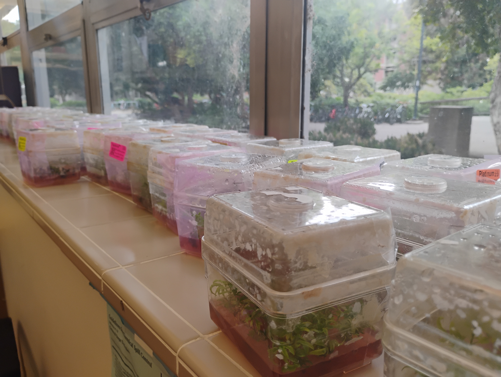
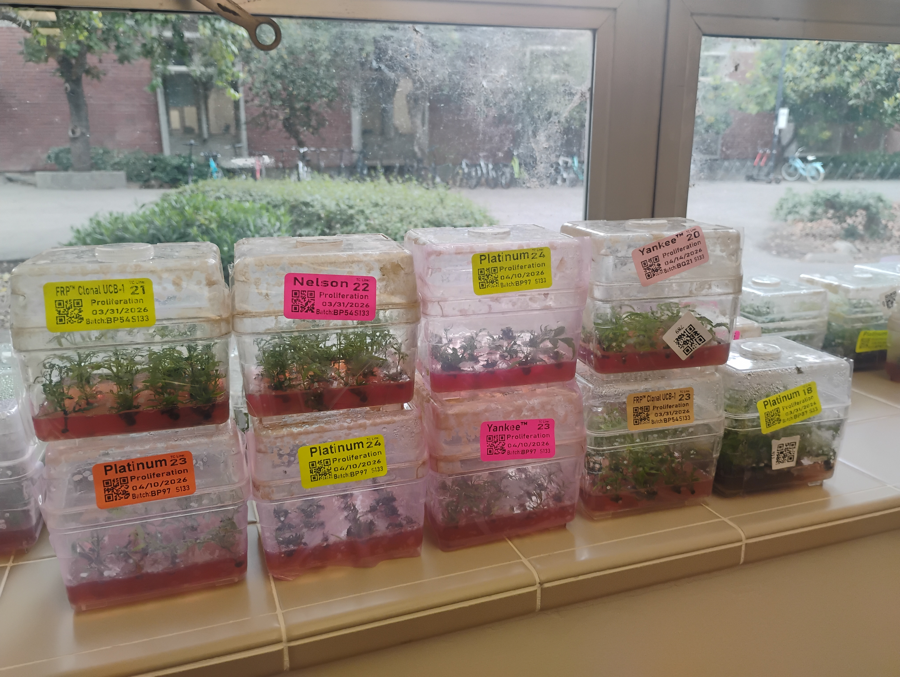

# Sierra Gold Tissue Culture Chromosome Stability

Whole-genome sequencing collaboration with [[Sierra Gold Nurseries]] to measure baseline rates of chromosome instability (aneuploidy, chromothripsis) across the rootstock lines they propagate in tissue culture. Monroe Lab covers all sequencing and analysis costs; Sierra Gold provides plant material and propagation provenance.

## Summary

Sierra Gold Nurseries (also operating as SG Trees / Feather River Plants) propagates millions of pistachio rootstock plantlets per year through its in-house tissue-culture facility. Multiple rootstock lines are maintained in parallel — including the original UCB-1 FRP Clonal, the Yankee and Nelson UCB-1 seedling selections, and the proprietary Platinum line — each initiated into TC in a different year and bottlenecked at different points over the propagation history.

The hypothesis is that *Pistacia integerrima* chromosomes (especially chr 1 and chr 3) accumulate large-scale chromosomal abnormalities at non-trivial rates during clonal propagation, and that these accumulate as a function of propagation rounds and bottlenecking events. We are sequencing across hundreds of clonal TC samples to (a) quantify a baseline rate of aneuploidy / chromothripsis across the propagation pipeline, (b) test whether older TC initiations and bottlenecked lines show more instability than younger / less-bottlenecked initiations from the same mother tree, and (c) ground-truth the genetics of three SG mother trees so that mother-vs-TC divergence can be measured directly.

The project is a continuation of the [[pbts|Pistachio Bushy Top Syndrome]] line of work and complements the [[kerman-somatic|Kerman somatic mutation project]] (scions, *P. vera*) by addressing the rootstock side (*P. integerrima* / hybrids).

## People

- **PI / Lead:** [[Grey Monroe]]
- **Sierra Gold contacts:**
  - Micah Stevens, PhD — Research Lab Manager, Sierra Gold Nurseries (technical contact, sample provenance, co-author)
  - Reid Robinson — COO, Sierra Gold Nurseries (business contact)
  - Steven Lee — coordinated Davis sample drop-off
- **UC Davis stakeholder:** Patrick J Brown (Plant Sciences, pistachio breeding) — CC'd on collaboration setup
- **Lab pipeline:** TBD (extraction lead, sequencing lead, analysis lead to be assigned)

Sierra Gold is named as a research collaborator, not anonymized. Micah is included as a co-author on resulting publications.

## Sample inventory — first batch (received 2026-05-05)

Sample list per Micah's 2026-04-30 shipment notice. Containers are tissue-culture proliferation jars (clean stock); mother-tree samples are 50 mL falcon tubes of leaf tissue.

| # | Material | TC init year | Type | Quantity | Notes |
|---|---|---|---|---|---|
| 1 | Yankee (UCB-1 seedling selection, vigor markers) | 2020 | TC jars | 10 | |
| 2 | Yankee | 2023 | TC jars | 10 | |
| 3 | UCB-1 FRP Clonal (original UCB-1 clone) | 2021 | TC jars | 4 | Not in active production — limited inventory |
| 4 | UCB-1 FRP Clonal | 2023 | TC jars | 2 | Not in active production — limited inventory |
| 5 | Nelson (UCB-1 seedling selection) | 2022 | TC jars | 5 | |
| 6 | Platinum | 2018 | TC jars | 10 | Heavy-production line, multiple bottleneck events visible |
| 7 | Platinum | 2023 | TC jars | 4 | Low proliferation since initiation, limited inventory |
| 8 | Platinum | 2024 | TC jars | 3 | Low proliferation since initiation, limited inventory |
| 9 | Yankee mother tree | (tree planted 2021) | Leaf, 50 mL falcon | 1 | -80 °C top shelf, dated 05/1/2026 |
| 10 | Platinum mother tree | (tree planted 2020) | Leaf, 50 mL falcon | 1 | -80 °C top shelf, dated 05/1/2026 |
| 11 | UCB-1 FRP Clonal mother tree | (tree planted 2019) | Leaf, 50 mL falcon | 1 | -80 °C top shelf, dated 05/1/2026 |

**Important provenance caveat (per Micah):** Any TC line whose initiation predates its corresponding mother tree's planting date was initiated from a *different, prior* mother tree that Sierra Gold no longer has access to. The three mother-tree leaf samples we received ground-truth the genetics for:

- Yankee TC lines initiated **2021 onward** (mother tree planted 2021)
- Platinum TC lines initiated **2020 onward** (mother tree planted 2020)
- FRP Clonal UCB-1 TC lines initiated **2019 onward** (mother tree planted 2019)

There is no TC phylogeny — within any given line / init year, Micah's TC populations are constantly mixed and containers were selected at random when boxing this batch.

## Storage

- **TC jars:** Currently on the lab bench / windowsill (see photos below). Need to be moved to a TC growth setup or scheduled for sample collection and DNA extraction promptly.
- **Mother-tree leaf falcons:** -80 °C Freezer A, top shelf, in a bag. Registered as [[locations/bag-sierra-gold-mother-trees-2026-05-01]].

## Photos

First sample batch on the lab windowsill, 2026-05-05. Color-coded labels visible: yellow = standard / clean stock, pink = Nelson, orange = older / lower-stock proliferation lot.

Visible labels (close-up):
- Top row: FRP™ Clonal UCB-1 21 · Nelson™ 22 · Platinum™ 24 · Yankee™ 20
- Bottom row: Platinum™ 23 · Platinum™ 24 · Yankee™ 23 · FRP™ Clonal UCB-1 23 · Platinum™ 18

Each label also carries a barcoded proliferation date and batch code (e.g. Platinum 18 → 3/31/2024, batch BP87 S33...).

## Propagation provenance & bottlenecking

Micah provided a historical TC inventory spreadsheet covering monthly container counts per line from 2021 through April 2026, with cells highlighting major drawdown events. Summary of notable drawdowns visible in the `Pivot for Pistachios` tab:

- **Platinum 18:** the heaviest production line. Monthly counts in the thousands to low tens-of-thousands from 2021 through early 2024, then a sharp drop to ~320 in Apr 2024 (highlighted), followed by extended low-count years before rebounding in 2026.
- **Yankee 20:** ramped from hundreds to high-thousands monthly through 2023–early 2024, then a highlighted drop to 191 in Jun 2024, followed by sustained low counts in 2024–2025 and a recent rebound.
- **FRP Clonal UCB-1 21:** ramped late 2023 to a peak of 1231 in Aug 2023, then highlighted drop to 300 in Dec 2023, then years of single-digit / low-tens counts as the line moved out of active production.

These drawdown events define candidate "bottleneck moments" — points at which propagation passes through a small effective population — which under a clonal-drift / mutation-accumulation framework would predict elevated within-line genetic divergence among the descendants.

**Spreadsheet:** [Micah Historic TC Data.xlsx (Google Drive)](https://docs.google.com/spreadsheets/d/1TXIBTh10LptxSdeM9J8nQtnQpdsQj2g4/edit) — full inventory (Combined, Old Netsuite, New Netsuite tabs) plus the `Pivot for Pistachios` summary tab. Filed under [Monroe Lab > Data > Sierra Gold TC Chromosome Stability](https://drive.google.com/drive/folders/1s55X73b9lj6ajM354aM8WQdEzG9VLgDA) on lab Drive.

## Sampling logic

Per the original collaboration offer to Micah and Reid, the broad strategy is:

1. **Anchor with mother trees** — sequence the three mother-tree leaf samples deeply (gold-standard reference for each line's expected genotype).
2. **Old vs. new TC initiations of the same line** — within Platinum, compare 2018 init vs. 2023/2024 inits; within Yankee, 2020 vs. 2023; within FRP Clonal UCB-1, 2021 vs. 2023.
3. **Within-init random draws** — sequence multiple containers from a single line / init year to estimate within-population variance (no TC phylogeny is available, so this is the operational substitute).
4. **Bottlenecked vs. non-bottlenecked windows** — choose containers from the highlighted drawdown months vs. high-count months for the same line (e.g. Platinum 18 pre- vs. post- Apr 2024 drop), as Sierra Gold's records and current inventory allow.

A formal per-container sampling sheet still needs to be built. Scale target: hundreds of samples for the full project.

## Pipeline

1. **Tissue harvest** — [[sierra-gold-tc-tissue-harvest]]. ~5 plantlets per 15 mL falcon, all from a single callus cluster. Photograph source box, log each tube as its own accession with callus notes.
2. **DNA extraction** — [[qiagen-dneasy-extraction|Qiagen DNeasy 96 Plant Kit]], 50–100 mg fresh tissue per well.
3. **Library prep:** short-read WGS for the bulk of samples; PacBio HiFi on a small panel for structural-variation resolution.
4. **Sequencing:** Novogene (short-read), Genome Center (HiFi).
5. **Analysis:** chromosome-scale read-depth and BAF for aneuploidy; structural-variant calling for chromothripsis-like events; per-line and per-init mutation accumulation; mother-tree vs TC divergence.
6. **Reference:** [[pistachio-pangenome|Pistachio Pangenome]] phased assemblies provide the *P. integerrima* / hybrid scaffold.

## Resources

- **Sampling protocol:** [[sierra-gold-tc-tissue-harvest]]
- [[Sierra Gold Nurseries]] — collaborator card (org-level)
- Micah Stevens · micah@sgtrees.com · 502-553-5290
- Reid Robinson · Reid@sgtrees.com
- Steven Lee — sample drop-off contact
- Bottlenecking spreadsheet: [Micah Historic TC Data.xlsx](https://docs.google.com/spreadsheets/d/1TXIBTh10LptxSdeM9J8nQtnQpdsQj2g4/edit)
- Drive folder: [Monroe Lab > Data > Sierra Gold TC Chromosome Stability](https://drive.google.com/drive/folders/1s55X73b9lj6ajM354aM8WQdEzG9VLgDA)
- Storage: [[locations/bag-sierra-gold-mother-trees-2026-05-01]]
- Related vault context (private vault, not in handbook):
  - Original collab offer email: msg:19db59dad5012c9a (2026-04-22)
  - Micah's enthusiastic reply: msg:19db5d777cda0420 (2026-04-22)
  - Sample shipment list: msg:19ddf876cb8c9ab3 (2026-04-30)
  - Bottlenecking spreadsheet email: msg:19de451def9f033b (2026-05-01)
- Featured in: AES Hatch Track 2 Project Initiation "Advancing genomic discovery for crop improvement" (Scientific Outline + Mission Outreach Statement, 2026-04-29)

## Related

- [[pbts]] — Pistachio Bushy Top Syndrome (parallel rootstock-instability story)
- [[kerman-somatic]] — scion-side somatic mutation work (*P. vera*)
- [[pistachio-pangenome]] — reference assemblies
- [[pistachio-hybrids]] · [[pistachio-short-read-wgs]]

#project #pistachio #pistacia-integerrima #ucb1 #platinum #yankee #nelson #sierra-gold #tissue-culture #chromosome-instability #aneuploidy #chromothripsis #wgs #clonal #active
