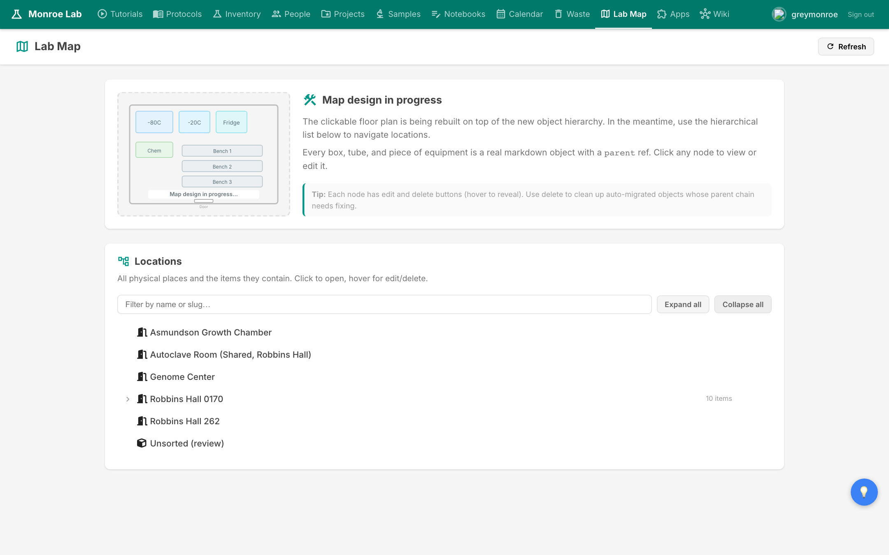
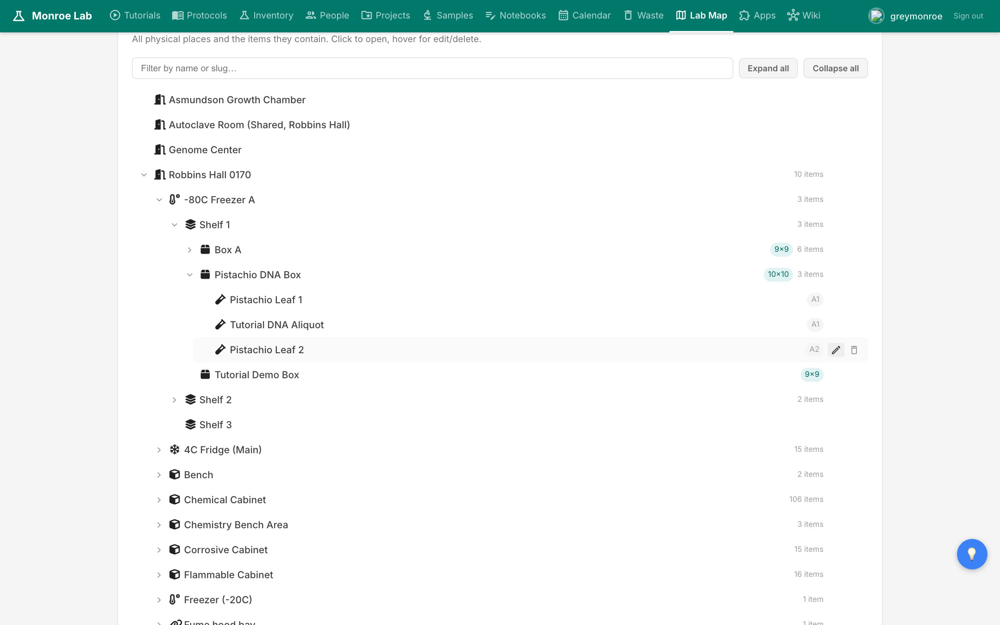
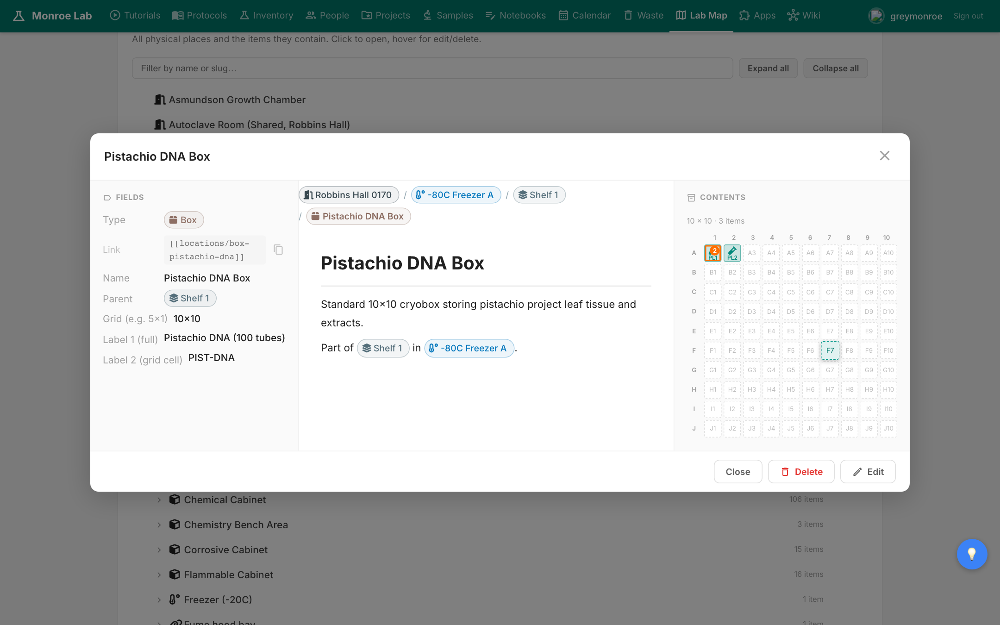
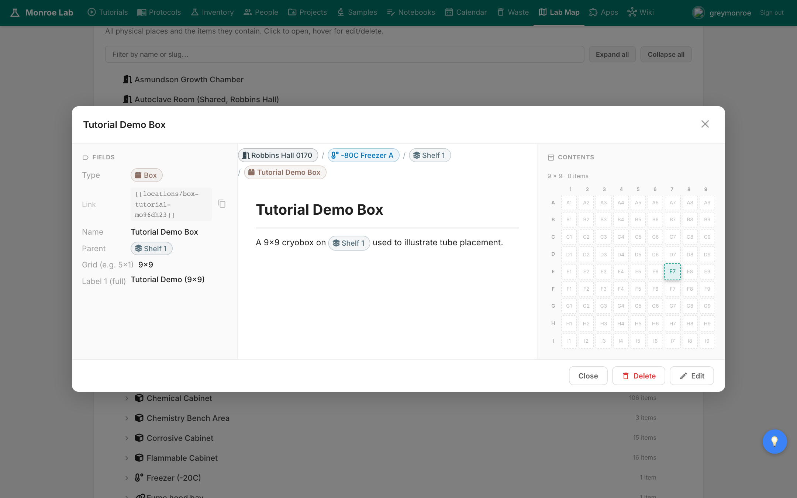
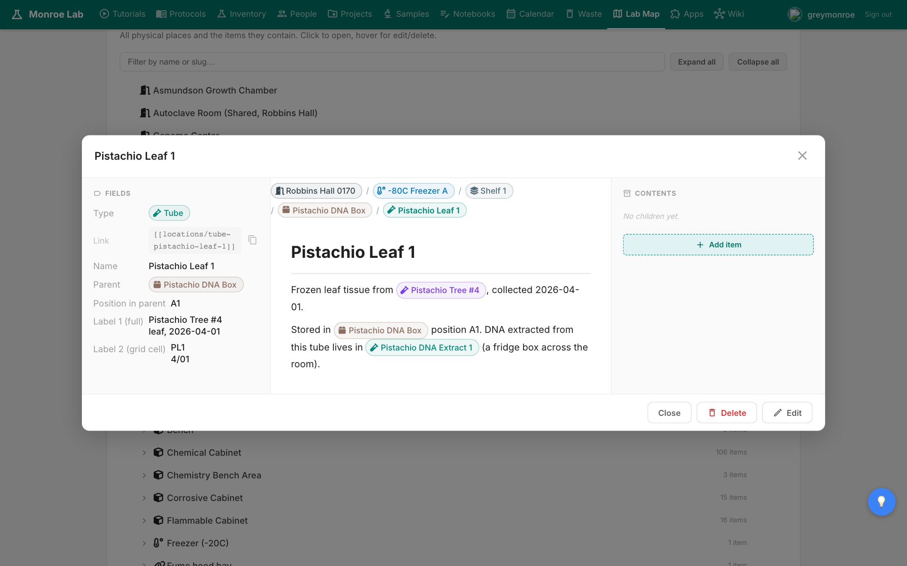
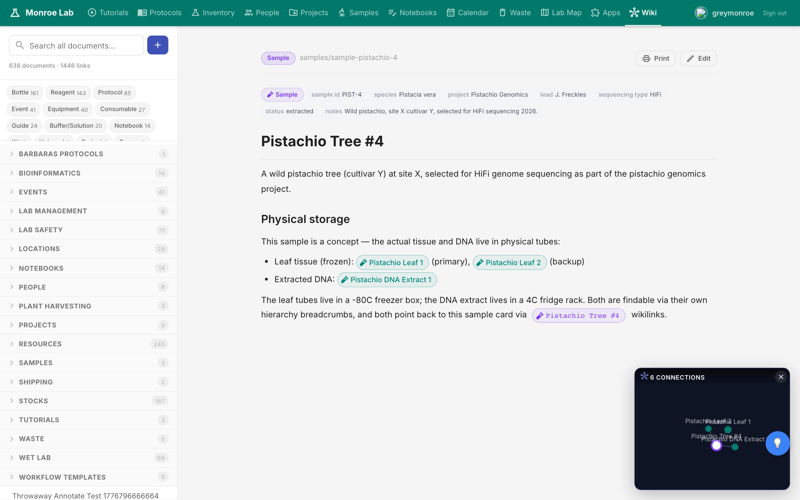
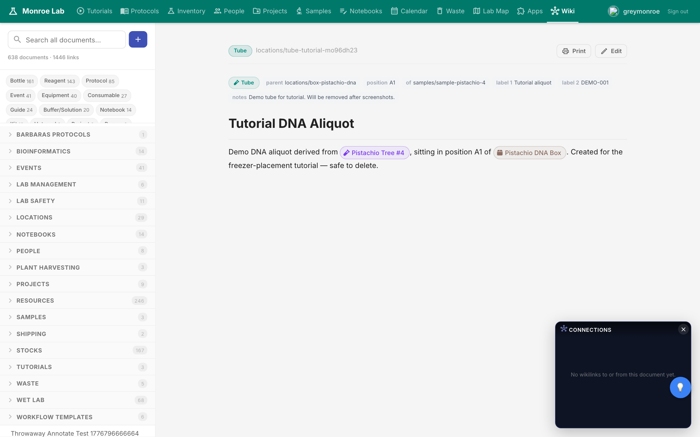

# Freezer Placement

Every physical thing in the lab — a tube of DNA, a box of tips, a freezer — lives somewhere specific. The Lab Map is the system that tracks where. This tutorial walks through placing a new tube into a freezer box so anyone else can find it later.

## What you'll learn

- The Room → Freezer → Shelf → Box → Tube hierarchy and why it matters
- How to navigate the lab as a nested tree
- How to place a new tube into a specific grid cell of a box
- How to add a whole new box to an existing shelf
- How breadcrumbs and backlinks tie everything together

## The hierarchy

Everything physical has one parent. A tube lives inside a box. A box sits on a shelf. A shelf is inside a freezer. A freezer is in a room. The full chain always walks back up to a room card like `Robbins Hall 0170`.

This is the only rule. There's no "where did I put it" — the parent chain tells you. The Lab Map renders this chain as a tree.

Click the chevron next to any node to expand it. Or click **Expand all** to open everything at once. Below, `Robbins Hall 0170` expands to `-80C Freezer A`, which has three shelves, one of which holds `Pistachio DNA Box` (a 10x10 box) with several labeled tubes inside at positions A1, A2, and so on.

Notice the small badges: `10x10` on a box tells you the grid layout; `A1` on a tube tells you which cell it sits in.

## Placing a new tube

Say you just extracted DNA from the pistachio sample (PIST-4). You want to freeze an aliquot and record exactly where it went.

**1. Open the target box.** Click the Pistachio DNA Box in the tree. A popup opens with the box's fields on the left and a clickable grid on the right. The grid is the physical layout of the box: each cell corresponds to a position inside it. Occupied cells show the tube abbreviation; empty cells are blank.

**2. Click an empty cell.** This is where your new tube will go. A form opens. Set:

- **Type:** `tube`
- **Title:** a short human label, e.g. `Pistachio DNA Aliquot 3`
- **of:** wikilink to the source sample card, e.g. `samples/sample-pistachio-4`. This is how the tube knows what it contains.
- **Position:** the grid cell you picked, e.g. `B3`
- **label_1 / label_2:** whatever you'd write on the physical tube with a Sharpie

The `parent` is set automatically to the box you clicked from. You never type a parent manually on the placement flow.

**3. Save.** The grid updates instantly and the tube now appears as a new node in the tree beneath the box.

## Adding a whole new box

If you're starting a new project that needs its own container, add a box to an existing shelf. Navigate to the shelf, click **Add item**, pick **box** as the type, give it a title, and set `grid` to `9x9` or `10x10` depending on the physical cryobox you have.

Same rule applies: the parent is set by where you added it. The new box shows up in the tree under that shelf with a `9x9` or `10x10` badge, ready to accept tubes.

## Verifying placement

Three views confirm the tube exists in the right place.

**From the tube itself.** Open the tube card. The top of the page shows a breadcrumb walking all the way up: Room → Freezer → Shelf → Box → Tube. Anyone reading the card can find the physical tube from that chain alone.

**From the sample card.** Open the `Pistachio Tree #4` sample. The "Physical storage" section lists every tube linked to it. Both the leaf-tissue tubes and the DNA extract tube appear because their `of:` field points back at this sample.

**From the tube page in the wiki.** The tube has a normal wiki card too — breadcrumb at the top, full content below, edit/delete on the right.

## The key insight

You never answer "where is X" by asking the freezer. You ask the tube, and it answers with its parent chain. That's why `parent:` is the only field that matters for placement, and why every physical object has exactly one. Get that right and the rest — grid views, breadcrumbs, backlinks, search — just works.

## Next

- [[inventory]] — for consumables tracked by quantity, not position
- [[lab-notebooks]] — log what you extracted and where it went
