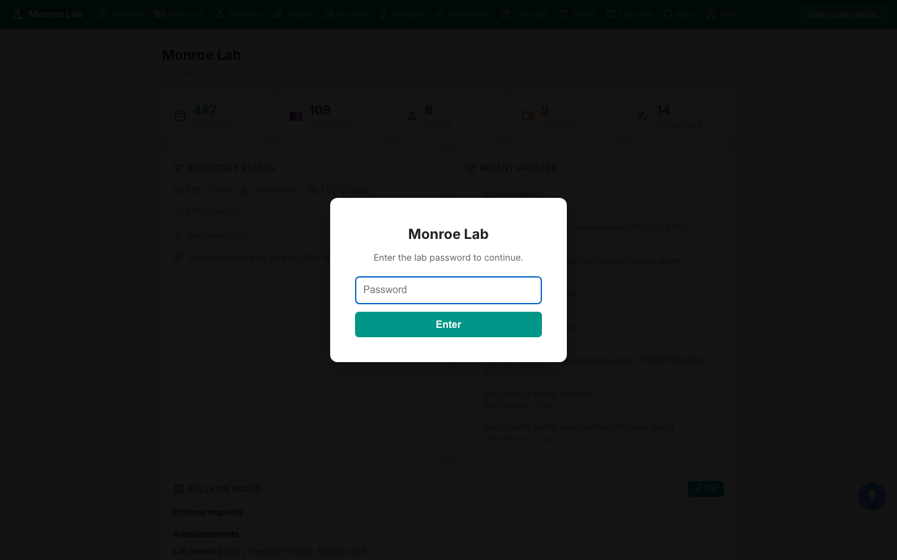
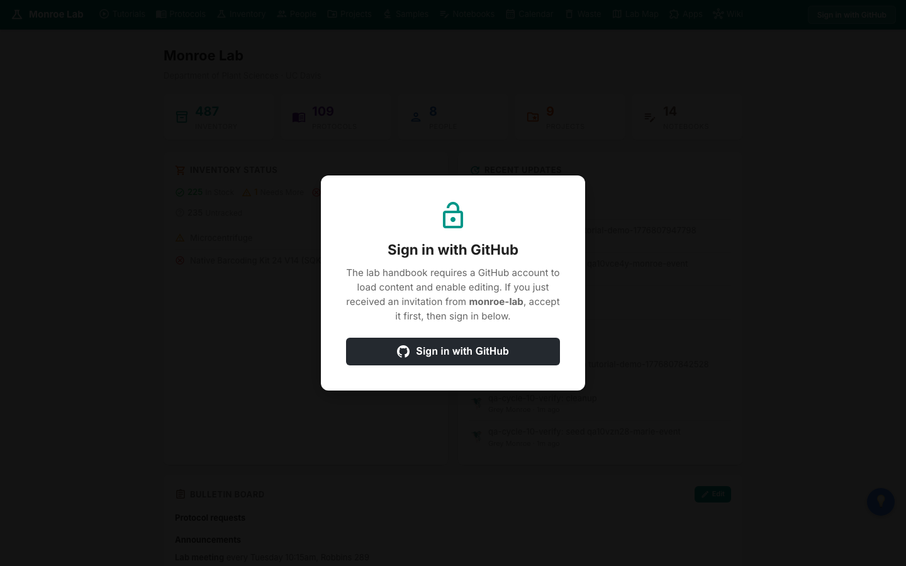
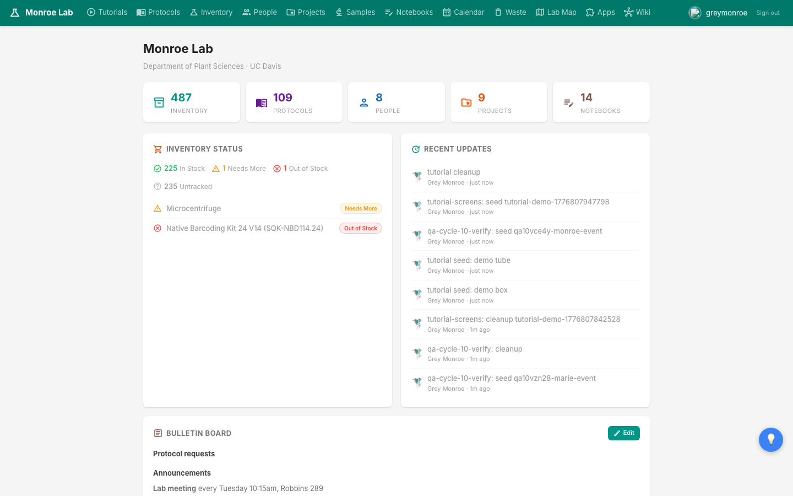
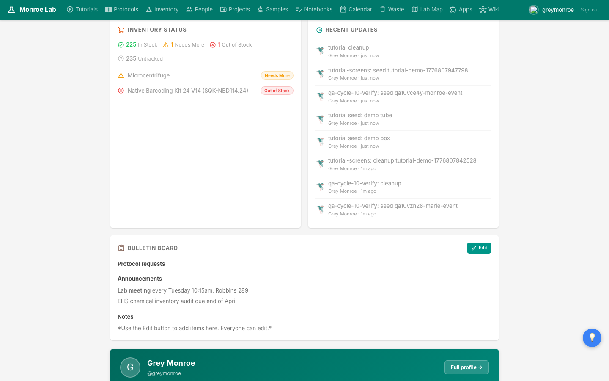
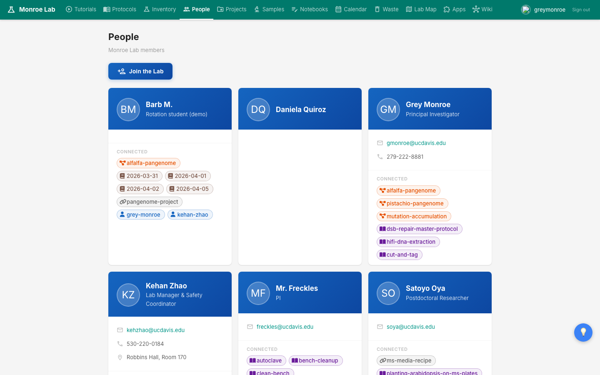
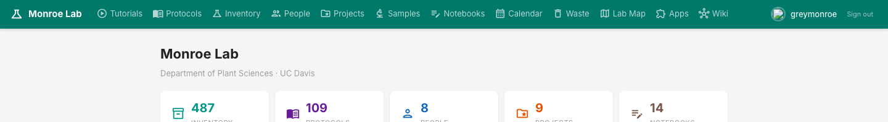

# Getting Started

Welcome to the Monroe Lab handbook. This walkthrough takes you from your first visit to the site to a working account that can edit protocols, post to your notebook, and update inventory.

## What you'll learn

- How to get past the lab password gate
- How to sign in with a GitHub account and create the token the site needs
- What you'll see on the dashboard and how to read it
- How to add yourself to the People page so you have your own notebook folder
- How to move around using the top navigation bar

## Step 1: The lab password

Open [monroe-lab.github.io/lab-handbook](https://monroe-lab.github.io/lab-handbook/) in any browser. The first thing you'll see is a small popup asking for the lab password.

Type `monroelab` and hit Enter. That's it for the first step. The password is shared across the lab and only keeps casual web traffic out; the real access control is the GitHub step that comes next.

## Step 2: Sign in with GitHub

After the password, a second popup asks you to sign in with GitHub. The site is hosted in a private repository, so it needs your GitHub identity to fetch content and save your edits.

Before you click Sign in, make sure two things are true:

1. **You have a GitHub account.** Create one at [github.com](https://github.com/) if you don't already. Use your UC Davis email or whichever address you plan to use for lab work.
2. **You've been added to the `monroe-lab` organization.** Ask Grey or the lab manager to send the invite, then accept it in your GitHub inbox. Until you accept the invite, the site won't load content for you.

When you click Sign in with GitHub, the site asks for a **fine-grained personal access token** (a token is basically a password that only works for a specific repository). You generate one at [github.com/settings/personal-access-tokens/new](https://github.com/settings/personal-access-tokens/new). Scope it to just the `monroe-lab/lab-handbook` repo with **Contents: Read and write** permission, set an expiration that works for you (a year is fine), copy the token, and paste it into the site when prompted. You only do this once per browser.

The token lives in your browser, not on a server. Anything you save, the site commits to GitHub on your behalf using that token.

## Step 3: Meet the dashboard

Once you're signed in, the dashboard is the landing page. It's your daily starting point.

The coloured cards across the top are live counts: how many **Inventory** items, **Protocols**, **People**, **Projects**, and **Notebooks** are on the site right now. Click any card to jump straight to that section.

Below them are three panels you'll come back to often:

- **Inventory Status** shows anything marked Needs More or Out of Stock. Keep an eye on this before you start work that needs a reagent.
- **Recent Updates** is a live feed of recent changes made by lab members. Useful for seeing what your coworkers have been editing.
- **Bulletin Board** is a pinned notice area. Lab meeting time, announcements, and anything the lab needs to see on arrival live here. Click **Edit** to post something.

## Step 4: Add yourself to the lab

Click **People** in the top nav, then click the big blue **Join the Lab** button. It launches a short onboarding wizard that captures your name, role, and a few details, and then creates your own Person page along with an empty notebook folder under your name.

You can come back and edit your Person page any time, so don't worry about getting everything perfect on the first pass.

## Step 5: Find your way around

The bar along the top is the main navigation. Every major section of the site has a home there.

The ones you'll use most:

- **Protocols** are the written procedures for wet-lab work. Think cloning, PCR, gels, seed sterilization.
- **Inventory** is the catalogue of reagents, consumables, kits, and stocks, plus where each one lives.
- **Notebooks** is where you write up what you did today.
- **People** is the directory of lab members.
- **Projects** groups work by funded research effort.
- **Wiki** is the free-form reference pages (bioinformatics guides, Farm cluster docs, house style rules).

The bottom-right corner always shows your GitHub username and a **Sign out** link. If you ever need to switch accounts or clear your token, use that.

## Next

- Once you're in, write your first entry: [[lab-notebooks]]
- Before your first protocol run, learn how the catalogue works: [[inventory]]
