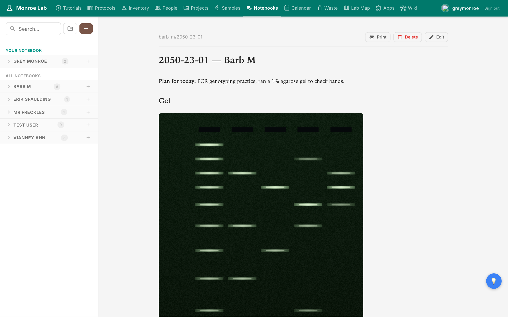
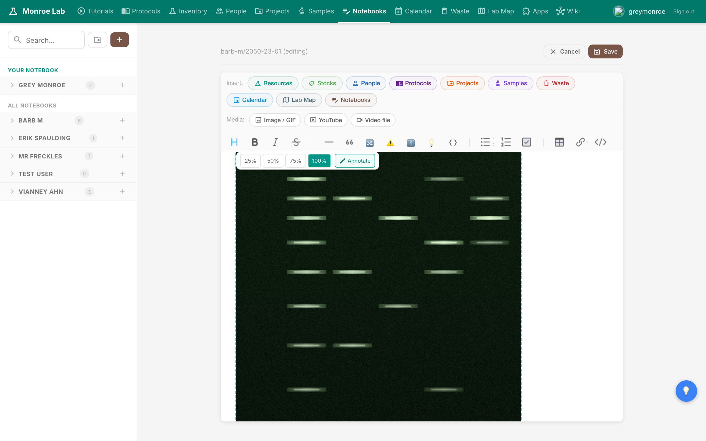
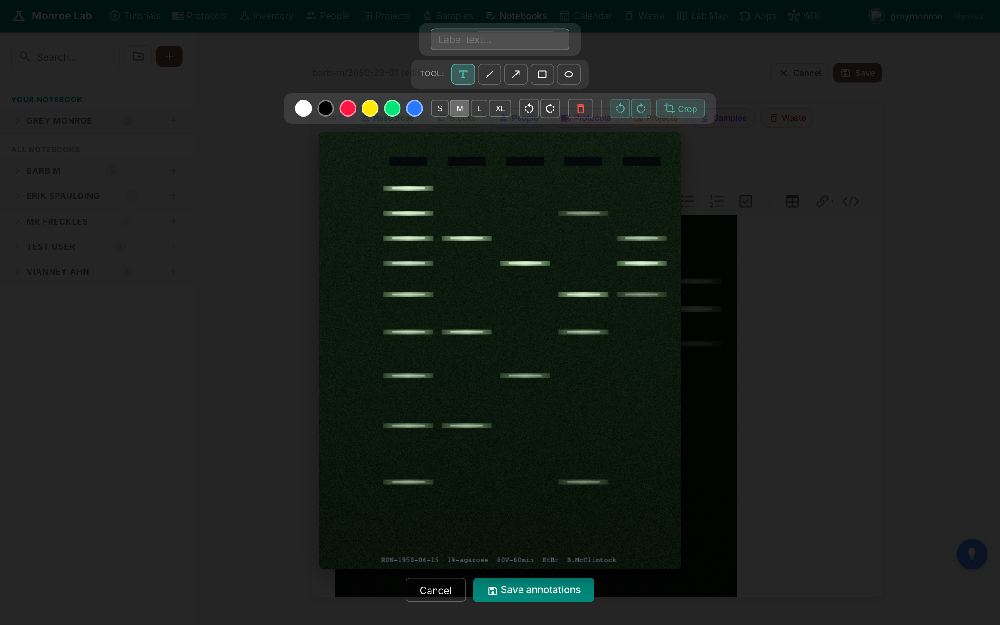
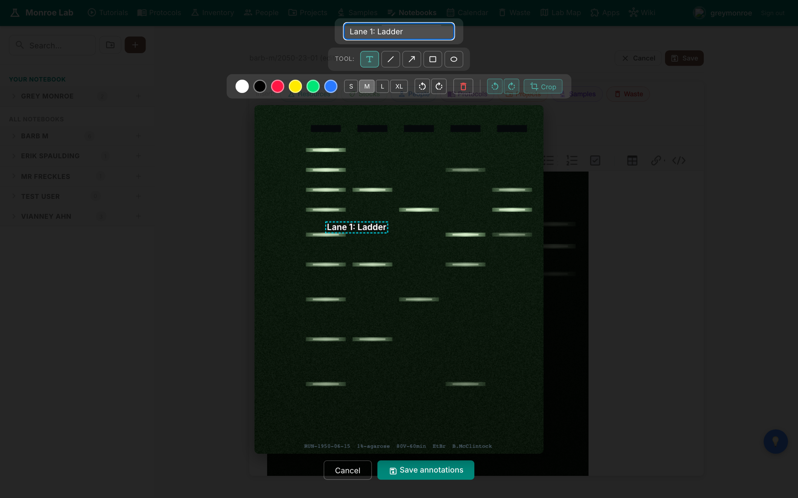
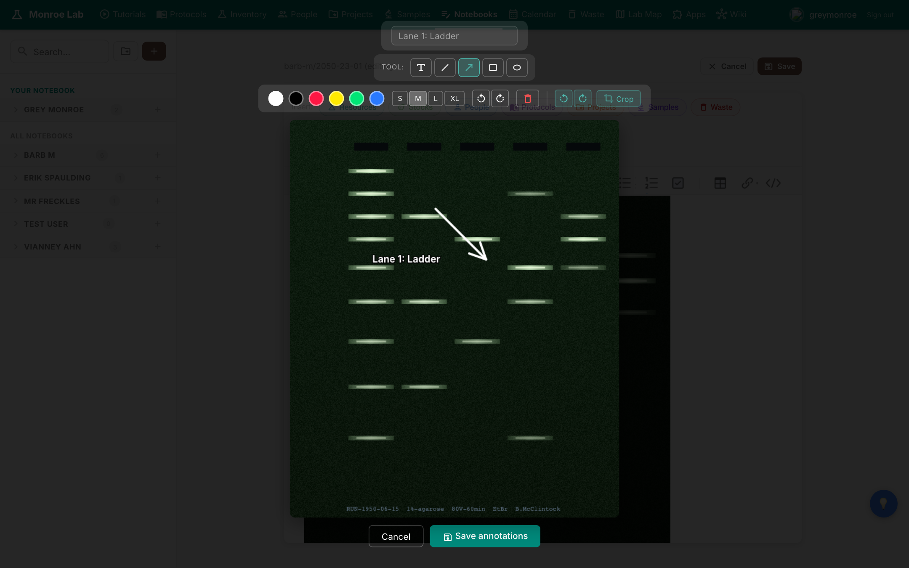

# Image Annotation

You ran a gel. You took a photo on your phone. Now you want to add a few labels and arrows before dropping it into today's notebook entry. The built-in image annotator does this without leaving the browser.

## What you'll learn

- How to add an image to a notebook or protocol (upload or clipboard paste)
- How to open the annotator on an embedded image
- The toolbar: text labels, lines, arrows, rectangles, ellipses, colors, sizes
- How to add a text label and draw an arrow
- How to crop, rotate, save, and where the result ends up

## Adding an image

In edit mode, use any of three methods to drop an image onto a page:

- Click the **Image / GIF** button in the editor toolbar to upload from your computer
- Paste from your clipboard (Cmd+V on Mac, Ctrl+V on Windows) — works for screenshots taken with Cmd+Shift+4 or the Snipping Tool
- Drag a file from Finder or File Explorer directly into the editor

The image uploads to the repo (`docs/images/`), and a reference like `` is written into the markdown. It renders inline:

## Opening the annotator

In edit mode, click an image to see its inline toolbar. The toolbar lets you resize the image (25%, 50%, 75%, 100%) and has an **Annotate** button with a pencil icon.

Click **Annotate** — or just double-click the image — to open the annotator. Your image fills the canvas and a dark toolbar floats above it.

The toolbar top to bottom:

- **Label text:** type here to edit the currently selected label
- **Tool row:** Text, Line, Arrow, Rectangle, Ellipse (the four shape tools were added recently)
- **Colors:** white, black, red, yellow, green, blue
- **Sizes:** S / M / L / XL (as a percent of image width, so labels stay readable when the image is resized)
- **Rotate and Delete** the selected annotation
- **Rotate image** 90 degrees left or right, and **Crop**
- **Cancel** and **Save annotations** at the bottom

## Adding a text label

1. Make sure the **Text** tool is selected (it's the default).
2. Click anywhere on the image. A label lands there and the text input becomes focused.
3. Type your label. It appears on the canvas as you type.
4. Drag the label to move it. Click elsewhere to deselect.

Change the color or size any time while a label is selected — the update is live.

## Drawing an arrow or line

Switch to the **Arrow** tool in the tool row. Click and drag across the canvas: press down where you want the arrow's tail, release where you want the head. Lines, rectangles, and ellipses work the same way.

To delete a shape or label, select it and click the red trash icon in the toolbar, or press Delete on the keyboard.

## Crop and rotate

**Crop** puts you in crop mode: drag a rectangle across the part of the image you want to keep, then click **Apply** to commit. Everything outside the rectangle is discarded.

**Rotate image** (the two teal circular-arrow buttons) rotates the whole image 90 degrees in place. Annotation positions move with the image, so labels stay attached to the bands they were pointing at.

## Saving

Click **Save annotations** at the bottom. The annotator flattens the labels and shapes onto a copy of the image and writes it as `<original-name>-annotated.png` next to the original. Your notebook entry is updated to use the annotated version automatically.

The original file is never modified. If you want to re-annotate later, double-click the `-annotated.png` image in edit mode and the annotator opens fresh on it. This is a flatten-and-done model: the annotator doesn't keep an editable layer after save, so make sure the labels are where you want them before you click save.

If you make a mess, click **Cancel** instead. Nothing is written.

## Next

- [[lab-notebooks]] — drop annotated gels into your daily entry
- [[protocols]] — embed annotated protocol diagrams the same way
