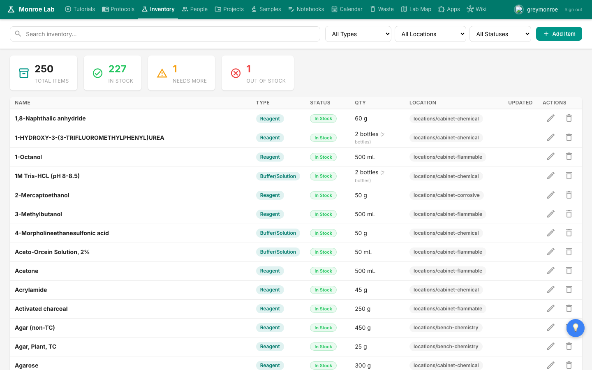
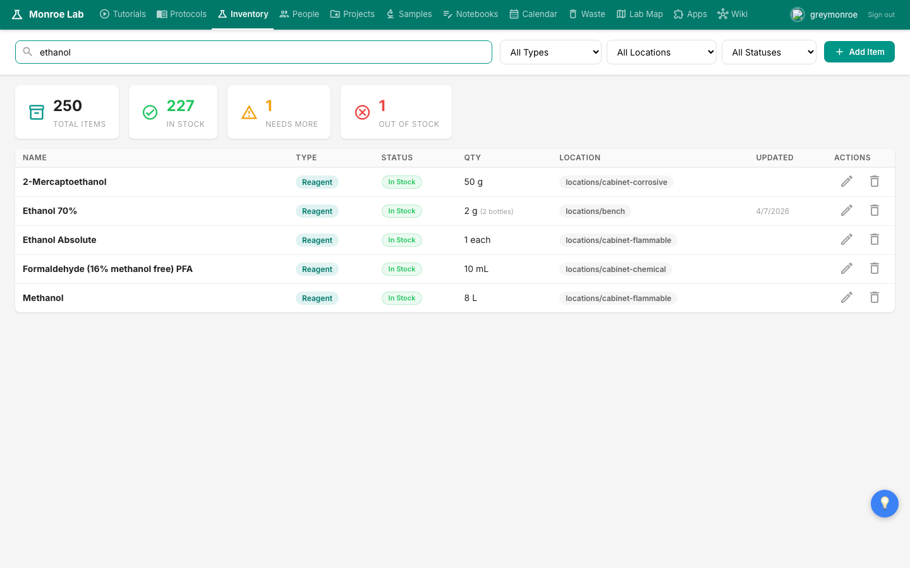
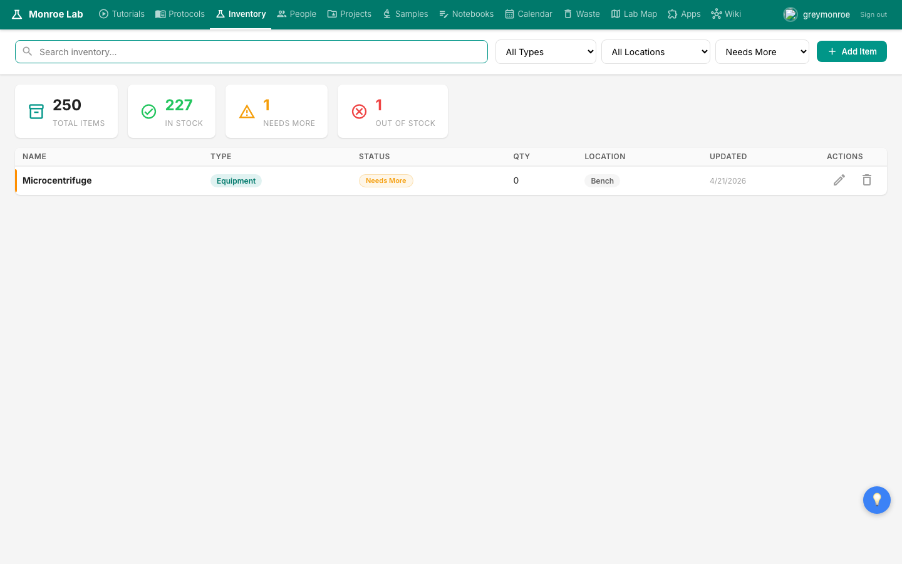
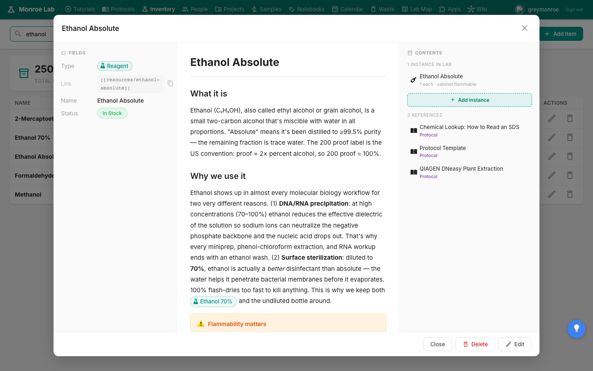
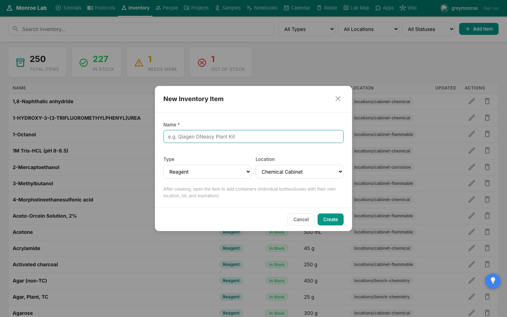

# Inventory and Reordering

The inventory page is the living catalogue of everything the lab owns: reagents, chemicals, kits, consumables, enzymes, seeds, plasmids, glycerol stocks. It tracks where each thing is, how much is left, and whether we need more. Keeping it current is a shared job: if you use the last of something, mark it.

## What you'll learn

- How to find a reagent quickly
- How to filter by type, location, and status
- How to mark something Needs More so it shows up on the dashboard
- How to add a new bottle (lot) of an existing reagent
- How to add a brand-new reagent that isn't in the catalogue yet

## Opening the inventory

Click **Inventory** in the top navigation. The page loads a sortable table of everything we track, with a search box and three filters across the top.

The four stat cards at the top are clickable shortcuts: Total Items, In Stock (green), Needs More (yellow), and Out of Stock (red). Click one to filter the table down to just that status.

## Search

The search bar on the left side of the toolbar is live: type any part of a reagent's name and the table filters in real time. For example, typing `ethanol` narrows the list down to the few reagents matching that word.

Clear the search box to see everything again.

## Filters

Next to the search bar are three dropdowns:

- **All Types** narrows the table to a single kind of item (Reagent, Chemical, Enzyme, Consumable, Kit, or for stocks: Seed, Glycerol, Plasmid).
- **All Locations** filters by where the thing lives: a specific cabinet, the refrigerator, a freezer, the bench.
- **All Statuses** filters by In Stock / Needs More / Out of Stock / External.

## Open a reagent to see details

Click any row in the table. A popup opens with the full details for that reagent: a description, safety notes, where it lives, its CAS number, and every physical instance we have (bottles, boxes, or tubes) with their lot numbers, quantities, and expiration dates. Anywhere the reagent is referenced in a protocol shows up under **References** on the right.

## Mark something as Needs More

The coloured **Status** pill on each row is clickable. One click cycles through the three states in order: **In Stock → Needs More → Out of Stock**. Set it to Needs More as soon as you notice a bottle getting low so it appears on the Dashboard's Inventory Status panel. Set it to Out of Stock the moment the last of it is gone.

You can also change status from inside the detail popup, and you can flip status on an individual bottle (rather than on the reagent as a whole) when that matters.

## Add a new bottle of something we already have

This is the most common edit. A new shipment arrives, you unpack it, and you want to record the new bottle against the existing reagent.

1. Find the reagent in the inventory (search by name).
2. Click the row to open its detail popup.
3. In the **Contents** column on the right, click **+ Add instance**.
4. Fill in the lot number, expiration date, size (e.g. `500 mL`, `1 L`), and the location the bottle will live in. Pick one of the existing locations (a freezer shelf, the flammable cabinet, the bench).
5. Click Create.

The new bottle shows up immediately under the reagent and also under the location you chose. On the Lab Map, it's now findable by its physical home.

## Add a brand-new reagent

If the thing you're adding isn't in the catalogue at all, click the green **+ Add Item** button in the top-right of the toolbar.

Give it a name, pick the Type (Reagent, Chemical, Consumable, etc), pick a Location, and click Create. The new item appears in the table right away. Open it and click **+ Add instance** to add the first physical bottle with its lot and size details.

For chemicals, take a moment after creating the item to fill in safety information (hazard class, SDS reference, storage notes). It takes a minute and keeps everyone safer.

## How it connects to the dashboard

Anything you mark Needs More or Out of Stock appears on the front-page **Inventory Status** card under Recent Updates. That's the list the lab manager uses when placing the next order. You don't need to email anyone: flipping the pill is the whole workflow.

## Next

- If a reagent's location isn't where you expected it, head to [[freezer-placement]] for how the Lab Map works.
- To see a reagent referenced in context, follow the links on a protocol page: [[protocols]]
