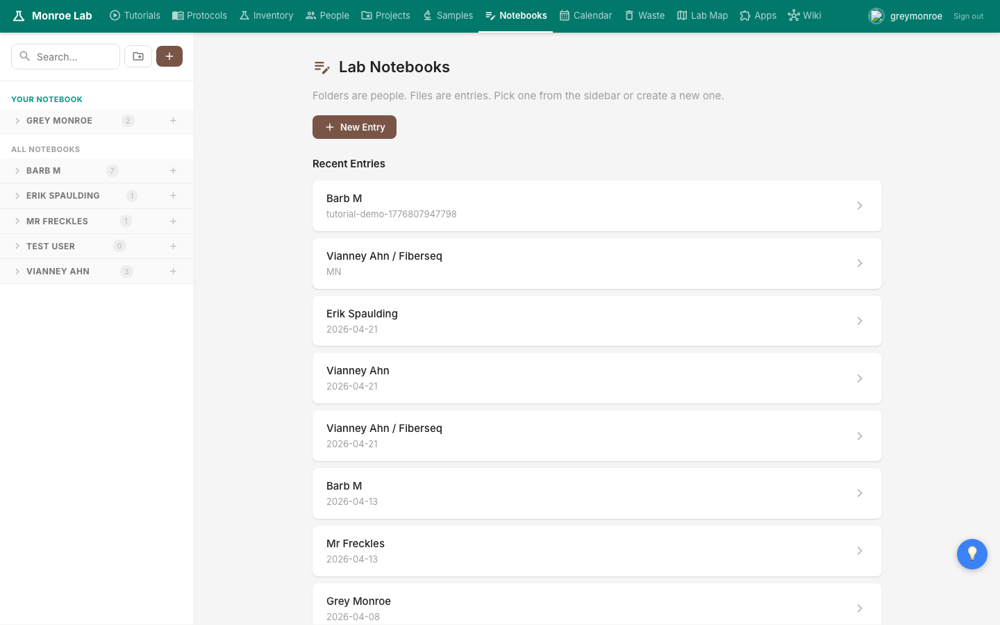
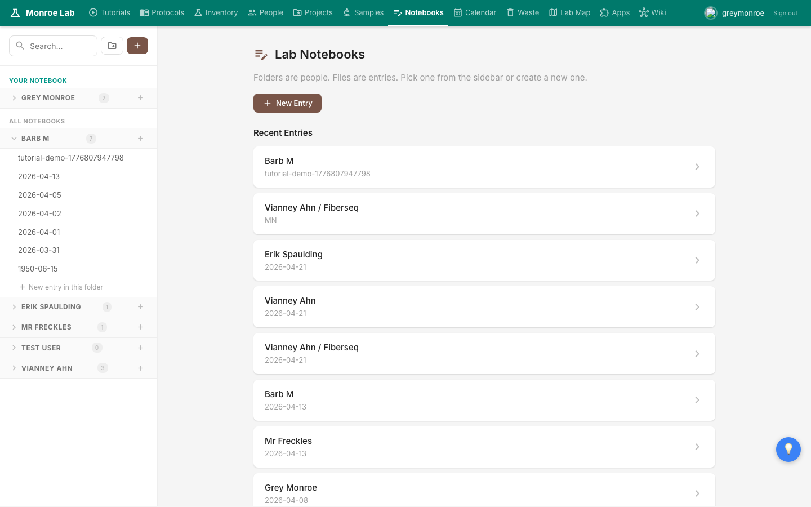
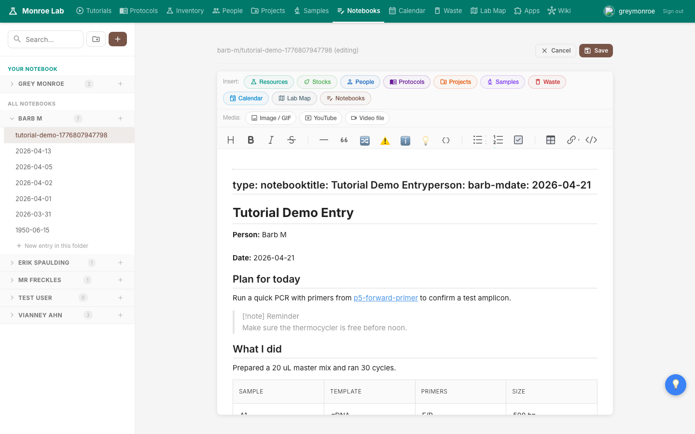
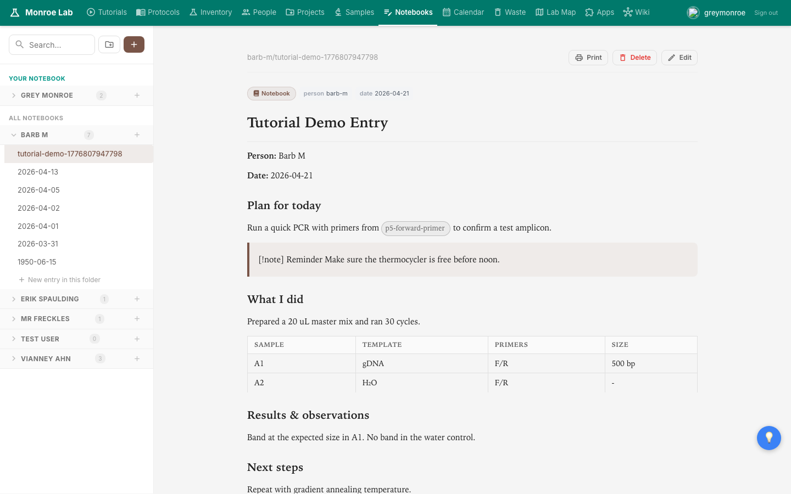

# Lab Notebooks

Your lab notebook is where you write down what you actually did. The handbook gives each lab member their own notebook folder, and a simple editor that saves directly to GitHub. Entries show up on the live site within seconds of you clicking Save.

## What you'll learn

- Where your notebook lives and how to find past entries
- How to create a dated entry for today
- How to add images, tables, callouts, and links inside an entry
- How saving works

## Where notebooks live

Click **Notebooks** in the top nav. You'll land on a split view: a sidebar on the left listing every lab member's folder, and the main area showing recent entries across the lab.

Your own folder is always pinned at the top under the teal heading **YOUR NOTEBOOK**. Everyone else sits below under **ALL NOTEBOOKS**, alphabetical by first name. The small number next to each person is how many entries they have.

## Create a new entry

Click your folder in the sidebar to open it. You'll see every dated entry you've written, plus a discoverable **+ New entry in this folder** row at the bottom.

Click that row. A small dialog asks you for a title. The default is today's date in `YYYY-MM-DD` format, which is almost always what you want for a daily entry. Hit Create and you'll land on a fresh page with a skeleton already filled in (Plan for today, What I did, Results, Next steps).

Tip: if you prefer a topic-based entry rather than a daily one, give it a title like `primer-design-notes` instead of a date. The two styles mix fine inside the same folder.

## The editor

Entries open in a rendered view by default. Click **Edit** in the top-right of the entry to switch into the editor. You'll see a WYSIWYG editor (Toast UI Editor) that behaves a lot like Google Docs.

The top row of coloured pills is **Insert**, for dropping in links to other items in the lab: a protocol, a reagent, a person, a project, a sample, or a location. Click one, pick the thing you want, and a styled pill appears in your text. The next row is **Media**: inline image/GIF upload, YouTube embed, or video file.

Below that is the standard format toolbar: headings, bold/italic/strike, horizontal rule, block quote, the three callout types (note/warning/tip), code block, lists, checklists, tables, link, and a source-code toggle.

On a phone, an **Aa** button appears in the bottom toolbar. Tap it to show or hide the format tools so you have more screen for writing.

## Add an image

The fastest way to get an image into an entry is to **paste from your clipboard**. Copy a photo from your phone, a screenshot, or anywhere else, click inside the editor where you want the image, and paste. The image uploads straight to the repo and embeds at its full size. You can drag the corner handles to resize after it drops in.

If you'd rather upload from a file, click the **Image / GIF** button in the Media row and pick a file.

## Add a wikilink

To link to another item in the lab (a protocol, a reagent, another notebook entry, a person, a location), type `[[` and start typing the name. An autocomplete menu appears. Pick the match you want and press Enter. It inserts as a pill, and on the rendered page the pill is clickable and shows a popup when hovered.

## Add a table or a callout

Use the Table button in the toolbar, pick a size, and a fresh table drops in. Tables render as proper styled tables on the saved page.

Callouts come in three flavours: **Note** (blue), **Warning** (yellow), **Tip** (green). Use them to set off something that shouldn't get lost in a wall of prose: a reminder, a caveat, a step you want a future you to notice.

## Save

Click the brown **Save** button in the top-right. The editor writes the file to GitHub, shows a success toast, and switches back to the rendered view. The entry is live on the deployed site within a few seconds thanks to the live-patch system that updates the page without waiting for a full rebuild.

**Cancel** throws away unsaved changes and returns to the rendered view.

## Read past entries

To review an earlier entry, click its filename in the sidebar. Each entry is its own page with a Print button, a Delete button (be careful), and the Edit button for going back in.

You can use the search box at the top of the sidebar to filter by filename across all folders. For full-text search across entries, the top-level Wiki search bar also indexes notebook content.

## Next

- Use links back to real lab items in your entries: [[inventory]]
- Once you've got an image in your entry, learn the annotation tools: [[image-annotation]]
