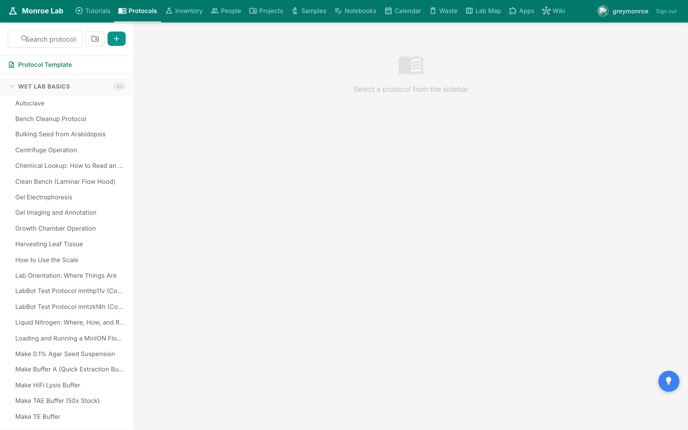
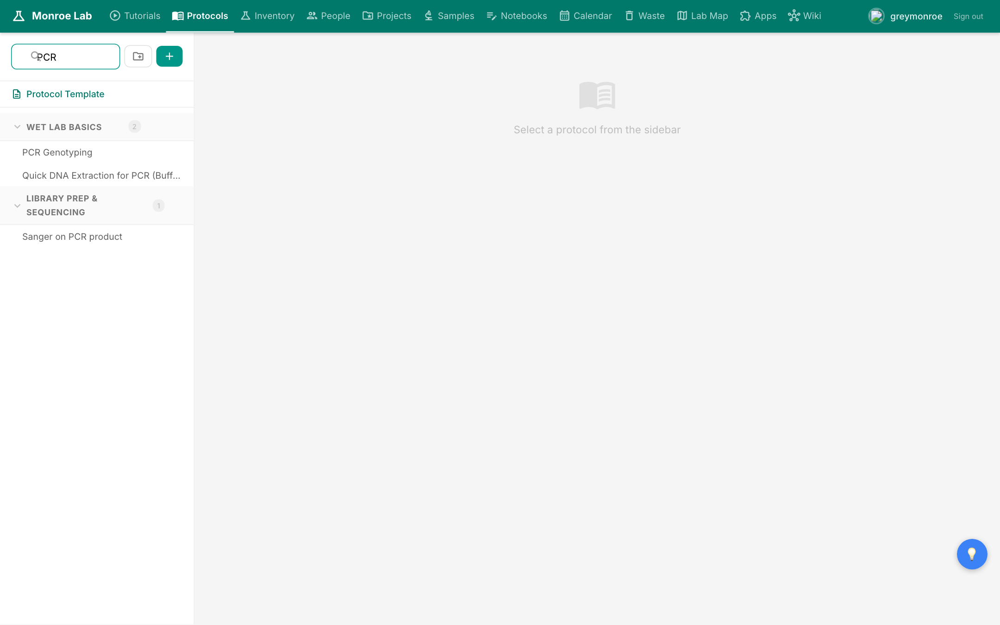
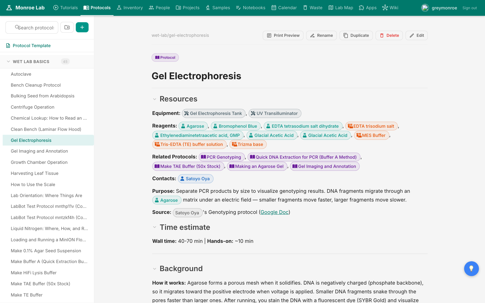
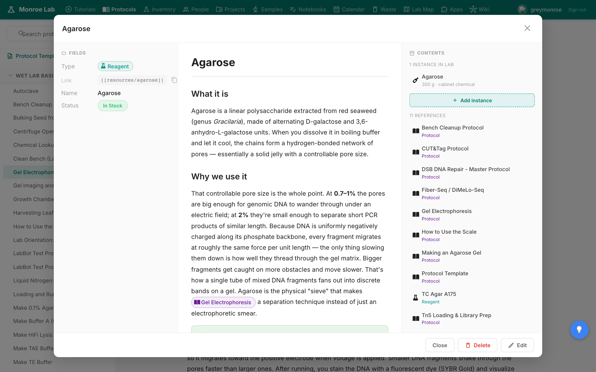
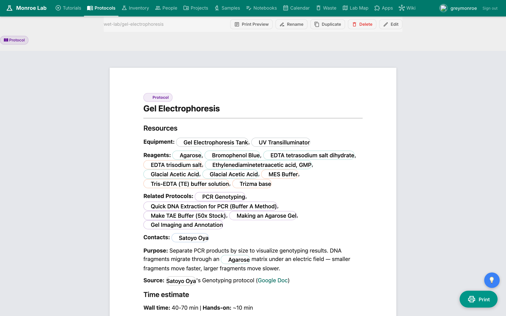
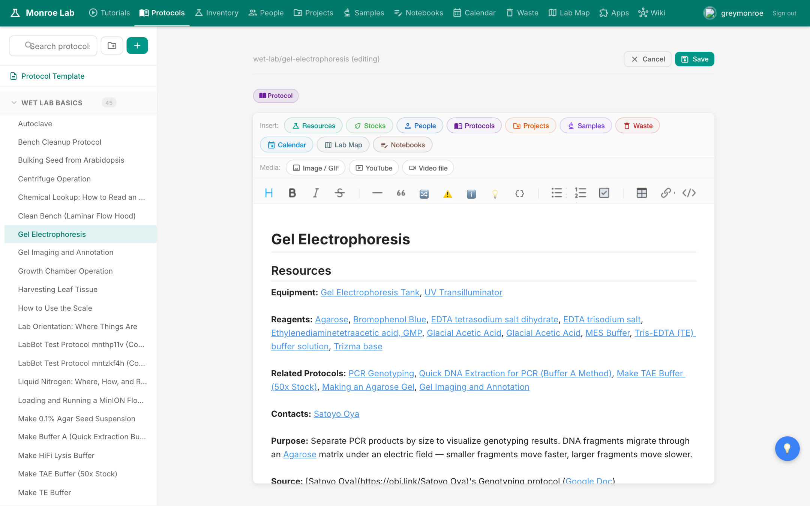

# Protocols

Protocols are the step-by-step procedures you follow at the bench. The Protocols app is where you find them, read them, print them, and edit them when something needs to change.

## What you'll learn

- How to find a protocol fast using categories and search
- How a protocol page is laid out (resources, reagents, equipment, steps)
- How wikilinks to reagents show live stock status on hover
- How to print a clean paper copy to take into the hood
- How to edit a step or duplicate a protocol as a starting point for a new one

## Finding a protocol

Click **Protocols** in the top navigation. The sidebar on the left is the full catalog: around 77 protocols grouped into eight categories, including Wet Lab Basics, DNA Extraction, Library Prep, Epigenomics, Mutagenesis, Lab Safety, Plant Harvesting, and Shipping. Click a category header to expand it.

If you already know a keyword, the **Search protocols** box at the top of the sidebar filters the whole catalog in real time. Typing `PCR` narrows the list to every protocol that mentions PCR.

## Reading a protocol

Click any protocol to open it on the right. The page is laid out in the same order every time: a **Resources** block (equipment, reagents, related protocols, contacts), a short **Purpose**, a **Time estimate**, then the actual steps with tables and inline images.

The colored pills (Agarose, TAE Buffer, UV Transilluminator, etc.) are **wikilinks**. They point at the reagent or equipment card in the lab wiki. When you click one, a popup opens showing the item's details: current stock status, location, instances available, and a backlink list of every protocol that uses it.

Check that popup before you start working. If the reagent shows a red "Needs More" badge, add it to your shopping list before you burn an hour realizing you're out.

## Printing a paper copy

Wet work is easier with a printed protocol on the bench. Click **Print Preview** in the top-right toolbar of any protocol. A paginated, letter-size preview opens with a floating teal **Print** button pinned to the bottom-right corner. Click it to send the PDF to your printer.

The print layout handles images and tables across pages without splitting them in weird places. Use it. Paper protocols are gloveable; screens are not.

## Editing a protocol

If a step is wrong, missing, or could be clearer, fix it. Click **Edit** in the top-right of the protocol. The view switches to a rich-text editor where headings, bullets, tables, and wikilinks all round-trip cleanly (the underlying markdown stays pristine).

Make your change, press Cmd+S (Mac) or Ctrl+S to save. Your change commits straight to the repo and redeploys in about 40 seconds. Everyone sees the update.

## Duplicating a protocol

To start a new protocol that's similar to an existing one, open the one you want to copy and click **Duplicate** in the toolbar. You get a `-copy` version you can rename and edit. It's the fastest way to spin up variants (e.g., the DSB-repair variant of an existing extraction).

## Next

- [[lab-notebooks]] — write up what you actually did today
- [[inventory]] — update stock when you use up a reagent
