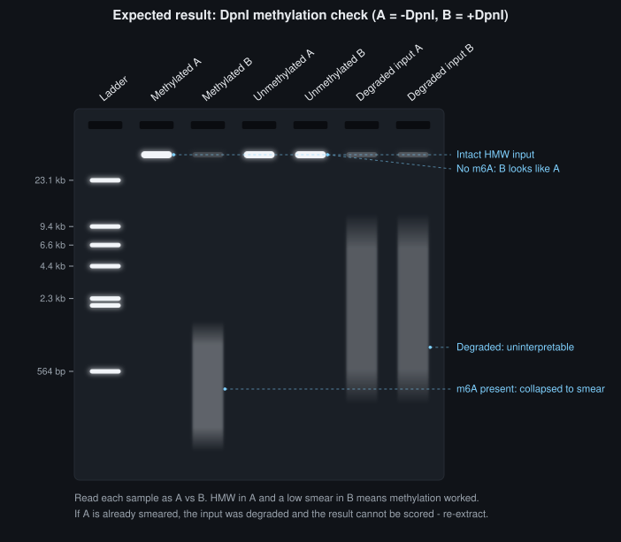

# DpnI Methylation Check

> **Draft — not yet bench-verified.** Confirm every volume and concentration against your own
> run before relying on it. Unresolved values are collected under § Notes, open questions and
> sources.

**What this does.** Answers one binary question about a DNA sample: **does it carry m6A?**
[[dpni|DpnI]] cuts `GATC` only when the adenine is methylated, so methylated DNA gets chopped
to a smear and unmethylated DNA stays high molecular weight. This page is the **readout** — it
does not care where the methylation came from.

**When to run it.**

- After [[fiber-seq-hia5-labeling]] — you labeled nuclei, extracted the HMW DNA, and want to
  know whether the labeling worked before spending a Revio cell on it. This is the go/no-go
  gate on real Fiber-seq material.
- After [[hia5-enzyme-activity-test]] — you ran a purified enzyme prep on naked DNA in vitro
  and need a readout for it.

**Time:** 1 h digestion + ~45 min gel run, plus pouring and imaging. Half a day if you are
also running the upstream Hia5 methylation reaction.
**Input:** 50–150 ng of **high molecular weight, intact** DNA per digestion reaction.

> **Hia5 methylates. DpnI cuts. Do not confuse them.** [[epicypher-cutana-hia5|Hia5]] is the
> methyltransferase (MTase) — it *writes* m6A and it is the thing being tested, but it is
> never added on this page. [[dpni|DpnI]] is a restriction enzyme that *reads* the mark, and it
> is the only enzyme you pipette here. Wherever this page says "MTase," it means Hia5 or a Hia5
> fusion such as Tudor-Hia5 or pA/G-Hia5.

## Materials

| Component | Amount per reaction |
| --- | --- |
| DNA to be scored | Volume giving 50–150 ng |
| 1× [[rcutsmart-buffer]] | 30 µL (older CutSmart also works) |
| [[dpni]] | 1 µL — **only in the +DpnI aliquot** |

Make 1× rCutSmart as **12 µL of 10× + 108 µL H₂O** per four reactions. Make one reaction extra
so you do not run short on the last tube.

The input DNA must be high molecular weight and intact going in. If it is already sheared,
digestion and no-digestion lanes look the same and the assay reports nothing. Handle with
wide-bore tips throughout and do not vortex.

## Procedure

### 1. Split each sample in two

**This is the whole design.** For every DNA sample you want to score, take two aliquots of
equal DNA mass:

| Aliquot | Gets | Reports |
| --- | --- | --- |
| **A** | 30 µL 1× rCutSmart, **no DpnI** | What the DNA looks like undigested — the within-sample baseline |
| **B** | 30 µL 1× rCutSmart **+ 1 µL DpnI** | Whether m6A is present |

The comparison is **A versus B on the same sample**. That is what makes the readout
interpretable: A controls for the input's own size distribution, handling damage, and
loading amount, so any difference between the two lanes is attributable to DpnI.

Everything beyond this pair is optional. See § Lane design below.

### 2. Digest

Mix with a **wide-bore tip** — the point of the assay is to detect fragmentation, so shearing
the input with a narrow tip corrupts the readout. Incubate both aliquots at **37 °C for 1 h**.

### 3. Gel

Pour a **1% agarose** gel during the digestion incubation. Run at **120 V for 45 min**,
loading as much of each sample as the well takes. See [[making-an-agarose-gel]],
[[gel-electrophoresis]], and [[gel-imaging-and-annotation]].

## Lane design — your call

**Minimum viable gel: two lanes per sample, A and B.** Nothing else is required to get an
answer. Add lanes from the menu below only when you have a specific reason, and note which
ones you added when you record the gel.

| Optional addition | What it buys you | When it is worth a well |
| --- | --- | --- |
| **Unmethylated input, ±DpnI** (a matched pair of the same DNA that never saw Hia5) | Catches endogenous or contaminating m6A in the source DNA. If this pair digests, your positives mean nothing | First time you use a new DNA source or species. The dev log flags checking Arabidopsis HiFi data for endogenous 6mA as an open question |
| **[[epicypher-cutana-hia5]]-treated positive, +DpnI** | Proves the DpnI, buffer, and gel are all working on a day when everything else came back negative | Any run where a negative result would be a consequential conclusion |
| **DNA ladder** | Lets you say *how* short the smear is, not just that it exists | Cheap. Include it unless you are tight on wells |
| **Hia5 titration series** (each ±DpnI) | Turns yes/no into a rough dose-response | Comparing constructs or lots — see [[hia5-enzyme-activity-test]] |
| **Timecourse** (each ±DpnI) | Same, over incubation time | The 03.16.2026 run used 5 / 20 / 60 min |

> **If you drop anything, do not drop aliquot A.** A gel of +DpnI lanes alone cannot
> distinguish "the enzyme worked" from "the input was already degraded."

## Safety

Standard BSL1. Gel stain handling and UV or blue-light imaging per
[[gel-imaging-and-annotation]] — use blue light where possible and wear a face shield with UV.

---

## Expected output

*Illustrative gel (not a real image). Read each sample as A versus B.*

- **Aliquot A** (no DpnI): high molecular weight, one tight band or a high smear. Same as the
  original input.
- **Aliquot B** (+DpnI), methylated: visibly shorter — a low smear or a collapsed band.
- **Aliquot B** (+DpnI), unmethylated: indistinguishable from A.

**Complete digestion of HMW DNA at the lowest Hia5 input you tested indicates high
activity.** In the March 2026 titrations that point was 25 nM.

## Interpreting results

| A | B | Read as |
| --- | --- | --- |
| HMW | Smeared | m6A present. Methylation worked |
| HMW | HMW | No detectable m6A. Either Hia5 did nothing, or the DNA never saw it |
| Smeared | Smeared | **Uninterpretable.** The input was already degraded. Re-extract or re-handle and repeat |
| Smeared | HMW | Impossible with a correct setup. Suspect a tube swap or a loading error |

If an unmethylated-input control pair was included and **it** digested, the source DNA carries
pre-existing methylation and every other lane on the gel is confounded.

> **What this does not tell you.** The DpnI gel is not quantitative and cannot report the
> 5–7% m6A/A window Fiber-seq actually needs. Passing this check means "methylation happened,"
> not "methylation happened at the right level." Level comes from the HiFi kinetics — see
> [[fiber-seq-master-protocol]].

## Troubleshooting

| Symptom | Likely cause | Fix |
| --- | --- | --- |
| No digestion in any lane | DpnI never went in, wrong buffer, or dead enzyme | Confirm the digestion buffer is rCutSmart and that DpnI actually went into aliquot B. Run an [[epicypher-cutana-hia5]]-treated positive to exonerate the digestion |
| No digestion, digestion known good | The upstream Hia5 (MTase) step failed | Go to [[hia5-enzyme-activity-test]] § Troubleshooting — SAM is highly labile and degrades with freeze/thaw, so suspect it before the enzyme |
| No-DpnI aliquot also smeared | Shearing during handling, or degraded input | Wide-bore tips throughout, no vortexing. Re-extract if the stock itself is gone |
| Unmethylated control digested | Endogenous m6A in the source DNA, or Hia5 carryover between tubes | Check whether the source could already be methylated; use fresh tips and a fresh dilution series |
| Partial digestion only at the highest Hia5 input | Low Hia5 activity | See [[hia5-enzyme-activity-test]] — increase Hia5, increase incubation, or match on active enzyme rather than total protein mass |

## Background — why this works

In this lab's workflow the m6A always comes from **Hia5**, a bacterial non-sequence-specific
N6-adenine methyltransferase — the MTase. Hia5 (free, or fused to a targeting domain) is what
deposits the methyl mark upstream; this page only detects it.

DpnI recognizes `GATC` but only cuts when the adenine in that site carries the N6-methyl
group. This is the same logic DamID is built on. So:

- **DNA that was methylated** → many GATC sites now carry m6A → DpnI cuts at all of them →
  the high-molecular-weight band collapses into a low smear.
- **DNA that was not methylated** → DpnI has nothing to cut → the DNA stays high molecular
  weight and looks identical to the undigested aliquot.

A gel is a sufficient readout because the question is binary. You are not measuring how much
m6A there is — that comes later, from the sequencing kinetics. A dead reaction and a working
one give visibly different lanes, and no quantification is needed to tell them apart.

## Notes, open questions and sources

**Page history.** Written 2026-08-18. Split out of the former combined "Hia5 DpnI Activity
Assay" page on 2026-08-20, because testing an enzyme prep and testing a DNA sample are
different questions. The reaction half lives on [[hia5-enzyme-activity-test]].

**Where the input amounts come from.** The lab has run this at 100 ng (03.30.2026 in vitro
test, and the 06.14.2026 setup) and at 50 ng (03.30.2026 verification of the 03.25.2026
Fiber-seq samples).

**Source.** Lab implementation in the *Fiber-Seq Experiments - Initial Tests* Google Doc
(*Fiber-Seq Experiments* tab, entries 03.06 / 03.16 / 03.25 / 03.30.2026) and the
*AnchorTag_NewUpdates_June2026* doc (06.14.2026 entry). Method adapted from the protocols.io
procedure for testing nanobody-Hia5 fusions (`g3iibykcf`).

**Open questions**

- `[VERIFY: resolve the full protocols.io URL and title for g3iibykcf before publishing.]`
- Does Arabidopsis carry endogenous 6mA that would confound this assay? The dev log flags
  checking existing HiFi data for it as an open task. Until that is settled, an unmethylated
  ±DpnI control pair is the only thing standing between you and a false positive on a new
  species or DNA source.

**What the lab has and has not established.** Construct-by-construct verdicts — including
which proteins have and have not actually been scored on a gel — are maintained in one place,
on [[fiber-seq-master-protocol]]. Do not duplicate them here.

## Resources and links

**Equipment:** [[thermocycler]], [[gel-electrophoresis-tank|gel electrophoresis tank]], [[uv-transilluminator|gel imager]]

**Reagents:** [[dpni]], [[rcutsmart-buffer]], [[agarose]]

**Consumables:** [[pcr-strip-tubes-0-2ml]], [[wide-bore-filter-tips-p200]]

**Related Protocols:** [[hia5-enzyme-activity-test]], [[fiber-seq-hia5-labeling]], [[fiber-seq-hmw-extraction]], [[fiber-seq-master-protocol]], [[gel-electrophoresis]], [[making-an-agarose-gel]], [[gel-imaging-and-annotation]]

**Contacts:** [[grey-monroe]]

**See also**

- [[hia5-enzyme-activity-test]] — the in vitro enzyme test that uses this page as its readout
- [[fiber-seq-hia5-labeling]] — the in-nuclei labeling reaction this page gates
- [[fiber-seq-master-protocol]] — the hub, and the maintained construct verdict table
- [[dpni]] · [[rcutsmart-buffer]]
- [[fiber-seq-development-log]]
