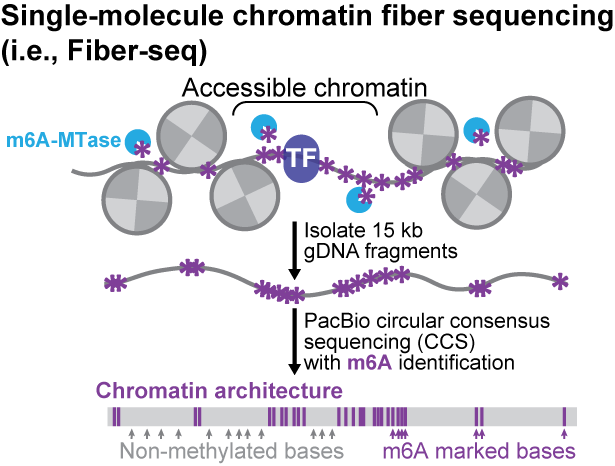

# (1) Fiber-seq Master Protocol

> **Draft — not yet bench-verified.** Confirm every volume and concentration against your own
> run before relying on it. Unresolved values are collected under § Notes, open questions and
> sources.

**What this does.** Fiber-seq maps chromatin accessibility, transcription-factor occupancy, and
nucleosome positioning at single-molecule, near-nucleotide resolution. Intact nuclei are treated
with [[epicypher-cutana-hia5]], a non-sequence-specific m6A methyltransferase (MTase), and
the resulting methylation pattern is read directly off long reads. PacBio HiFi is the readout
everything below is written around, but see step 7 — it is no longer the only platform on the
table.

*The logic behind every step below. Accessible adenines get marked in intact nuclei (step 2),long fragments are isolated (steps 3 and 5), and CCS with m6A calling turns the methylationpattern into a footprint map (step 7). The methylated bases are the accessible ones — proteinfootprints are the **gaps**. Note the 15 kb in the middle panel is the schematic's number, nota lab target; see step 5 for what the lab actually aims at.*

**When to use this page.** This is the hub — a decision map, not a bench procedure. Read it
first, then work through the linked step pages in order. Each of those pages is the thing you
actually run at the bench.

**Time:** two days, more or less (Grey, 2026-08-20). **Day 1 is nuclei isolation plus the Hia5labeling reaction** (steps 1–2). **Day 2 is the HMW extraction and the DpnI check** (steps 3–4).
Size QC, library prep and sequencing follow after that and add days to weeks at the core.
**Input:** fresh or -80 °C frozen tissue. Arabidopsis Col-0 seedlings and pistachio (PBTS) shoot
culture have both been run; walnut is listed in the development log but never run.

> **Two checks decide whether the experiment produced data at all.** (1) The DpnI gel at step 4
> is the go/no-go gate before you spend money — a Revio run on unlabeled DNA gives you a
> perfectly good genome and zero Fiber-seq data. (2) On PacBio, sequencing must be run with
> **base kinetics enabled**; m6A is called from polymerase kinetics, not from sequence.

## Procedure — the step map

### 1\. Isolate nuclei — [[2-plant-nuclei-isolation-for-fiber-seq]]

Tissue in, counted nuclei out. Grind 500 mg–3 g in liquid nitrogen, lyse 20 min on ice in
nuclei isolation buffer, filter, and wash twice by centrifugation. **The count is the gatefor step 2**, and it is also the weakest measurement in the chain — see that page's note on
CellDrop under-counting.

### 2\. Label with Hia5 — [[3-hia5-m6a-labeling-reaction-for-fiber-seq]]

The whole experiment. Resuspend counted nuclei in activation buffer with SAM, add Hia5,
**10 min at 25 °C**, stop with SDS to 1% final. Nuclei input and reaction volume are both
decided here. Which Hia5 to use is decided from the table below.

### 3\. Extract HMW DNA — [[fiber-seq-hmw-extraction]]

Straight from the SDS-stopped reaction, no freeze in between. **CTAB + chloroform-isoamyl +SeraMag beads is the lab default** (Grey, 2026-08-18), established after the NEB spin-column
route failed on this input.

### 4\. Confirm labeling worked — [[dpni-methylation-check]]

Take a small aliquot of the extracted DNA, digest with DpnI, run a gel. DpnI cuts GATC only
when the adenine is methylated, so digestion is a direct readout of whether Hia5 did
anything.

> **Critical:** This is the go/no-go gate before you spend money. A Revio run on unlabeled
> DNA produces a perfectly good genome and zero Fiber-seq data.

### 5\. Size QC and shear decision — [[ot2-hmw-shearing]]

Run the extracted DNA on the [[femtopulse]] before deciding anything. (Genome Center does this)

> **Decision point.** Per Noravit Chumchim (UC Davis DNA Technologies Core, 05.01.2026): if
> the pre-shear distribution is already narrow *and* its mode already sits in the range you
> want post-shear, **skip shearing** and go straight to library prep. As a general rule,
> samples where >50% of the DNA is longer than 30 kb with no prominent peak under 20 kb
> will land at roughly a 20 kb mode after pipette shearing.

### 6\. Size selection — [[hmw-size-selection]]

Optional, and decided from the FemtoPulse trace. Cutting short fragments buys HiFi yield on a
production run; on a troubleshooting run they are worth keeping. That page has the decision
table.

> **Critical:** the Genome Center's LightBench takes **1 µg in a maximum of 25 µL**, so a pool
> under **40 ng/µL** is not eligible at all. Concentrate before submitting, not after.

### 7\. Library prep and sequencing — [[pacbio-hifi-sequencing]]

Both plant papers used the SMRTbell prep kit 3.0. **The kit currently in the lab is theHiFi plex prep kit 96.** Library input in the published work was 3.5 µg of DNA; in general
0.5–2 µg of gDNA is typical, but the real requirement comes from the sequencing platform's
own recommendations for native whole-genome applications.

> **Critical:** On PacBio, sequencing must be run with **base kinetics enabled**. m6A is called
> from polymerase kinetics, not from sequence. Without kinetics there are no `MM`/`ML` tags, no
> m6A calls, and the entire experiment is wasted.

**Nanopore is on the table too.** Grey has flagged (2026-08-20) that the lab may bring in a
**MinION** for Fiber-seq testing, so the readout is no longer assumed to be HiFi only. Nothing
upstream of step 7 changes — nuclei, labeling, extraction and the DpnI gate are platform-agnostic,
and the DpnI check is if anything more valuable when you are also validating a new readout. What
does not carry over is this step's PacBio-specific detail: the base-kinetics setting, the
SMRTbell/HiFi plex prep, and the `MM`/`ML` tags all belong to PacBio. How the lab would call m6A
off nanopore reads has not been worked out here yet, and no MinION run has been done. Treat this
as a stated intention, not a procedure.

## Which Hia5 do I use?

**This table is the single source of truth for construct verdicts** (Grey, 2026-08-18).
Other pages link here rather than repeating it. Established by primary-source check of the
development record on 2026-08-18, round-2 status revised 2026-08-20. Concentrations, purities
and lot details for every construct live on [[hia5-protein-stocks]]. Each construct name in the
table links to its own card, which carries the full amino-acid sequence, the QC as delivered,
every test it has been through, and a place to record its freezer location.

| Enzyme | Status | Use for production Fiber-seq? |
| ------ | ------ | ----------------------------- |
| [[epicypher-cutana-hia5]] | Validated, commercial | **Yes — the only validated option** |
| [[hia5-r1-free\]] | Project-stage, no individual verdict recorded | No |
| [[pa-hia5-r1\]] | Project-stage, no individual verdict recorded | No |
| [[pag-hia5-r1\]] | Project-stage, **no written verdict anywhere** | No |
| [[tudor-hia5-r1\]] | **Failed** the 03.30.2026 DpnI assay | No |
| [[3atudor-hia5-r1\]] | Project-stage; binding-pocket knockout, i.e. a negative control | No |
| [[tudor-hia5-r2\]] | **Reported functional, never scored** — see § Notes | Not yet |
| [[3atudor-hia5-r2\]] | Same reported-but-unscored status; negative control regardless | No |

> **Critical:** The only Hia5 the lab can currently claim as validated for production
> Fiber-seq is [[epicypher-cutana-hia5]]. The Tudor and pA/pAG constructs are project-stage
> reagents from [Anchor Tag](../../projects/anchor-tag/index.md) and must not be treated as
> interchangeable with it. What the record does and does not actually say, verdict by verdict,
> is laid out under § Notes — read it before citing any of these statuses.

Round 2 also delivered two **MNase** fusions, [[tudor-mnase-r2]] and [[3atudor-mnase-r2]]. They
are deliberately absent from the table above because they are not Fiber-seq reagents at all: MNase
cuts DNA, it does not methylate it, so no dose of it will ever produce m6A and a DpnI gel says
nothing about it. They belong to the CUT&RUN-style arm of [Anchor Tag](../../projects/anchor-tag/index.md)
and are the only round-2 proteins with a substantial bench history.

## Safety

* **Liquid nitrogen** for grinding — cryo gloves, face shield, ventilated area.
* **β-mercaptoethanol** in the nuclei isolation buffer — fume hood.
* **Chloroform-isoamyl alcohol** in the CTAB extraction — fume hood only, halogenated
    organic waste.
* CTAB and SDS are irritants. Standard BSL1 otherwise.

Each step page carries its own safety section. Read the one for the step you are running.

***

## Expected output

| Metric | Target |
| ------ | ------ |
| Genome-wide m6A | \~5–7% |
| Coverage | 30×, or 60× if haplotype-phased |
| Inferred nucleosome length | Consistent with \~150 bp — shorter means over-labeled |
| Data-quality check | Clear accessibility peaks at transcription start sites |

Note on read depth: increasing depth calls more accessible regions, but the additional calls
are progressively lower quality, representing infrequently occupied elements and more false
positives. More depth is not automatically better.

Analysis tooling lives at [fiberseq.github.io](https://fiberseq.github.io/) — 6mA is taken
from the PacBio `MM` tag, nucleosome occupancy via FiberHMM, and Fiber-seq Inferred
Regulatory Elements (FIREs) are the accessible-patch calls. **Analysis is out of scope forthis buildout (Grey, 2026-08-18) and will get its own page.**

## Timing detail

Documented incubations only. Hands-on time has never been recorded. The day grouping is Grey's
(2026-08-20) and is approximate.

| Day | Stage | Documented elapsed |
| --- | ----- | ------------------ |
| **1** | [[2-plant-nuclei-isolation-for-fiber-seq]] | 20 min lysis on ice + 2 × 15 min spins, plus grinding, filtering and counting |
| **1** | [[3-hia5-m6a-labeling-reaction-for-fiber-seq]] | 5 min pellet spin + **10 min reaction** |
| **2** | [[fiber-seq-hmw-extraction]] | 20 min lysis at 55 °C + 10 min spin + 10 min CI mixing + 10 min spin + 30 min bead binding + washes |
| **2** | QC — [[dpni-methylation-check]] | 1 h digest + \~45 min gel (plus 1 h MTase step if you are also running [[hia5-enzyme-activity-test\]]) |
| after | QC — FemtoPulse, Qubit, NanoDrop | — |
| after | Shearing → library → sequencing | Days to weeks, at the core |

Note the seam: [[fiber-seq-hmw-extraction]] says to go straight from the SDS-stopped labeling
reaction into CTAB lysis with no freeze in between, so in practice the day-1/day-2 boundary
falls inside the extraction rather than cleanly before it. Plan day 1 to run long enough to at
least get the reaction into lysis.

## Troubleshooting

| Symptom | Likely cause | Where to look |
| ------- | ------------ | ------------- |
| No m6A on the DpnI gel | Dead SAM, dead enzyme, or a project-stage construct | [[dpni-methylation-check]], then [[1-1-sometimes-hia5-enzyme-activity-test-in-vitro]] |
| m6A too high, footprints washed out | Too much enzyme or too long an incubation | [[3-hia5-m6a-labeling-reaction-for-fiber-seq]] |
| Inferred nucleosomes shorter than \~150 bp | Over-labeling | [[3-hia5-m6a-labeling-reaction-for-fiber-seq]] |
| Low 260/230, DNA will not behave downstream | Guanidine carryover from column extraction | [[fiber-seq-hmw-extraction]] |
| Short fragments on the FemtoPulse trace | Mechanical shearing (tolerable) vs degradation (not) | [[fiber-seq-hmw-extraction]] |
| Nuclei count implausible against pellet size | CellDrop under-counting, unresolved | [[2-plant-nuclei-isolation-for-fiber-seq]] |
| Sequencing returned no m6A calls at all | Base kinetics not enabled | Step 7 above |

## Background — why this works

### What Fiber-seq measures

A chromatin fiber is the three-dimensional organization of DNA wrapped around histones.
Bulk accessibility assays like DNase-seq and ATAC-seq average that organization across
millions of cells, so they tell you that a regulatory element is accessible *on average*
without telling you whether it was accessible on any individual molecule. Fiber-seq
resolves the primary architecture of chromatin along its underlying DNA template on
**individual multi-kilobase molecules**, which is what makes it possible to ask whether a
promoter and its enhancer were open on the *same* fiber.

### Why Hia5, a non-specific m6A MTase, reports accessibility

**Hia5 is the methyltransferase** in this workflow — a bacterial N6-adenine DNA
methyltransferase (MTase) with no sequence-context preference. It is the enzyme that writes the
m6A mark, and nothing else in the protocol methylates DNA. (The other enzyme you will meet,
[[dpni]], is a restriction enzyme used only to *detect* that mark on a gel.)
Applied to intact nuclei, Hia5 methylates any adenine it can physically reach. DNA that is
wrapped in a nucleosome or occupied by a transcription factor is shielded, so **a proteinfootprint appears as a localized gap in m6A along a single long read**. Two size classes of
methylase-accessible region are expected, and both were seen in the original work: elements
averaging \~272 bp that coincide with DNase-hypersensitive sites, and far more numerous \~67 bp
elements with regular spacing, matching internucleosomal linkers.

Because the enzyme is native to bacteria, which lack histones, it is worth knowing that its
behavior on non-chromatinized DNA is a live question rather than a settled one.

### Reading footprints and nucleosomes

The distance between adjacent m6A marks is the primary signal. Recurrent \~150 bp gaps
indicate nucleosome occupancy, and the oscillatory pattern in those spacings has been read
as nucleosome breathing. Well-positioned nucleosomes — those at the same location across
most cells in the population — show up as regular ripples in the m6A signal, and largely
originate from fibers where the regulatory element is in an actuated state.

"Regulatory DNA actuation" is the all-or-none adoption of a nucleosome-free state that
makes the underlying DNA hyperaccessible. Single-molecule data is what lets you see that
it is all-or-none rather than graded.

### Why PacBio HiFi specifically

m6A is not called from sequence. It is called from **polymerase kinetics**, and the calls
are carried in the BAM `MM`/`ML` tags. This has two consequences that determine whether an
experiment works at all: the sequencing run must be configured with **base kineticsenabled**, and read length caps how much chromatin context you get per molecule, which is
why every upstream step is organized around keeping DNA long.

### The \~5–7% m6A window

Too little methylation and there is no signal. Too much and the footprints disappear into
background — with high global m6A you cannot resolve which regions were genuinely
inaccessible. PacBio targets a working range of **\~5–7% 6mA** as the balance between
footprint resolution and over-labeling. Within putative regulatory elements, the fraction
of m6A per A/T rises with enzyme input, so higher but still moderate labeling improves
transcription-factor footprint resolution.

**The over-labeling check is inferred nucleosome length.** If the nucleosome lengths you
infer from the data are shorter than the real \~150 bp, you have over-labeled.

### How this relates to the lab's other assays

[[cut-and-tag]] and [[chip-seq]] ask where a *specific* protein is bound, genome-wide and
in aggregate. Fiber-seq asks what the *whole* accessibility landscape looked like on each
individual molecule. Fiber-seq and DiMeLo-seq share this nuclei-prep lineage and the same
Hia5 chemistry; DiMeLo-seq adds an antibody or protein-A fusion to target the methylation
to one factor. The lab's [Anchor Tag](../../projects/anchor-tag/index.md) constructs are the route to that targeted version.

## Notes, open questions and sources

**Page history.** Written 2026-08-18 from the lab's Fiber-seq development record. Construct
verdict table revised 2026-08-20 after a primary-source recheck of the round-2 claim. Reordered
2026-08-20 to put the step map above the reference material. Round-2 evidence extended
2026-08-20 from the `AnchorTag/RUN_NEW` spreadsheet, with the experiment-row count corrected
from "\~50" to the actual 70 the same day.

**Source.** Lab development record — [[fiber-seq-development-log]] and the source Google
Doc *Fiber-Seq Experiments - Initial Tests* (2026), *Protocol* tab. Round-2 inventory and the
June 2026 experiment log come from the Google Sheet *AnchorTag/RUN\_NEW*
(tabs `June2026`, `Jan2026`, `Jan2026 - 2`, `AnchorTag`, `NUCLEI`). Read the **lab-owned copy** in
`Monroe Lab / Order/Inventory/Space / Protein Stocks`:
[AnchorTag_RUN_NEW (lab copy of Vianney's, 2026-08-20)](https://docs.google.com/spreadsheets/d/16YT_2reiyBNsnpwCbjCaFuVPBMVdYS8eX3SZL6LWZcw/edit).
All five tabs and every cited range were verified identical to the original on 2026-08-20.
Published plant methods: [PNAS 2025 plant Fiber-seq](https://www.pnas.org/doi/10.1073/pnas.2516708122)
and the [Nature Plants maize TE paper, May 2025](https://www.nature.com/articles/s41477-025-02002-z).
Commercial reference: Epicypher CUTANA Fiber-seq product documentation.

### What the lab has and has not established

What the record actually says about the Hia5 constructs, and what it does not:

* The one explicit verdict, verbatim from 03.30.2026, is *"ONLY Tudor-Hia5 reactions did notsuccessfully methylate adenine."* Round-1 Tudor-Hia5 **failed**. The word "ONLY" implies
    free Hia5, pA-Hia5, 3ATudor-Hia5 and the Epicypher control worked, but **no individualverdict is recorded for any of them.**
* **pAG-Hia5 has no written verdict at all.** It appears only in undated and 03.16.2026
    titration gel images with no accompanying conclusion.
* A separate 03.30.2026 note, *"Samples are successfully methylated,"* refers to
    **Epicypher-Hia5-treated Fiber-seq nuclei** — a different experiment with no Tudor
    construct in it. **Do not conflate these two sentences.** Conflating them is how the lab's
    notes previously recorded the Tudor result backwards.
* **Round 2 (June 2026, MBP-fused) is reported functional but has never been scored.** The
    only statement is [[vianney-ahn]]'s, verbatim from a Slack DM on 2026-08-06:
    *"I did test the Hia5 from the more recent shipment from June, and they seem to befunctional."* Take it as suggestive, not as a result — it names no construct, points at no
    gel or date, and is hedged. The shipment held **four** proteins, not two: Round2\_A
    Tudor-Hia5, Round2\_E 3ATudor-Hia5, Round2\_C Tudor-MNase and Round2\_F 3ATudor-MNase. "The
    Hia5 from the June shipment" therefore narrows to A and E at best, and does not distinguish
    between them. The 06.14.2026 setup was documented and then the record stops with no outcome
    written down. No functional QC was ordered from GenScript for round 2 either; the purchased
    QC was SDS-PAGE and Western blot only. See [[1-1-sometimes-hia5-enzyme-activity-test-in-vitro]] § Round 2.
* **The June 2026 bench record contains no Hia5 work at all.** The `AnchorTag/RUN_NEW`
    spreadsheet — the lab's own round-2 inventory and experiment log — has **70 experiment rows**
    across four dates (06/08, 06/11, 06/15 and 06/29 2026), and the enzyme column reads
    `Tudor-MNase` on 43 of them, `3ATudor-MNase` on 24, and `pAG-MNase` on 3. Not one Hia5 row.
    The same sheet's inventory tab fills in
    vial counts (`6 × 4.00 mL`) and worked-out per-reaction dilutions for both **MNase** rows and
    leaves both columns **blank for both Hia5 rows**. The consistent reading is that the round-2
    Hia5 proteins were received, never worked up, and never run — which is why this table keeps
    them at *reported, unscored*.

> **Even a scored gel would only establish half of it.** The DpnI readout measures methylation.
> Whether a fusion's reader domain actually binds its target has never been tested and needs a
> separate DiMeLo-seq-style experiment. "Tudor-Hia5 is functional" from a gel means the Hia5
> half works.

### Open questions

* `[VERIFY: score the June/July 2026 round-2 gels construct by construct, or record explicitly on [Anchor Tag](../../projects/anchor-tag/index.md) that round 2 is unscored and why. Per Vianney (Slack, 2026-08-11) the round-2 tubes are dated — June/July dates are the newer batch.]`
* `[VERIFY: a lab-owned copy of AnchorTag/RUN_NEW was made 2026-08-20, so the data survives Vianney's offboarding — but the ORIGINAL is still hers and still being edited (last modified 2026-08-20). The copy is a snapshot and will drift. Either transfer ownership of the original and delete the copy, or agree that the copy is now the lab's record of it. Do not leave two live versions.]`
* **Resolved 2026-08-20.** The GenScript paperwork for both Hia5 orders (U9375BAEG0 round 1,
    U4194NJYG0 round 2) previously existed only as Gmail attachments — a Drive search for those
    IDs returned zero files. All 16 documents are now filed under
    `Monroe Lab / Order/Inventory/Space / Protein Stocks`, and the round-2 COAs were read and
    checked against the figures on [[hia5-protein-stocks]]. See that page for the folder links.
* `[VERIFY: sweep Vianney's other lab folders (FiberSeq, CUT/Anchor&Tag, Lab Management Guides) for anything else owned by her account. The four Tn5 COA PDFs that were in Protein Stocks were copied to lab ownership on 2026-08-20; that folder is now clear, the others are not.]`
* `[VERIFY: plants are assumed to have negligible endogenous 6mA background, which is what makes the m6A signal interpretable. Checking this against the lab's existing Arabidopsis HiFi data was flagged as a to-do in the development log and has never been done. Do it before publishing any FDR claim.]`
* `[VERIFY: actual hands-on times. Nothing in the development log records them. Time a run, or ask Vianney.]`
* `[VERIFY: the two papers cited above are recorded in the lab doc by URL only. Resolve full author/title/DOI citations via /cite-add before any of this text is reused in a manuscript or grant. Handbook links are fine as-is.]`

## Resources and links

**Equipment:** [[celldrop]], [[centrifuge]], [[femtopulse]], [[nanodrop]], [[qubit-fluorometer]], [[thermocycler]]

**Kits:** [[qubit-dsdna-hs-assay-kit]]

**Reagents:** [[epicypher-cutana-hia5]], [[hia5-protein-stocks]], [[s-adenosylmethionine]], [[spermidine]], [[sucrose]]

**Consumables:** [[dna-lobind-tubes]], [[wide-bore-filter-tips-p1000]], [[wide-bore-filter-tips-p200]]

**Related Protocols:** [[2-plant-nuclei-isolation-for-fiber-seq]], [[3-hia5-m6a-labeling-reaction-for-fiber-seq]], [[fiber-seq-hmw-extraction]], [[dpni-methylation-check]], [[1-1-sometimes-hia5-enzyme-activity-test-in-vitro]], [[hmw-size-selection]], [[ot2-hmw-shearing]], [[pacbio-hifi-sequencing]], [[cut-and-tag]]

**Contacts:** [[grey-monroe]]

**See also**

* [[fiber-seq-development-log]] — the dated method-development record this page is built from
* [Anchor Tag](../../projects/anchor-tag/index.md) — the Hia5 fusion construct project
* [[cut-and-tag]], [[chip-seq]] — related epigenomics protocols
* [[pacbio-hifi-sequencing]], [[ot2-hmw-shearing]] — downstream library work