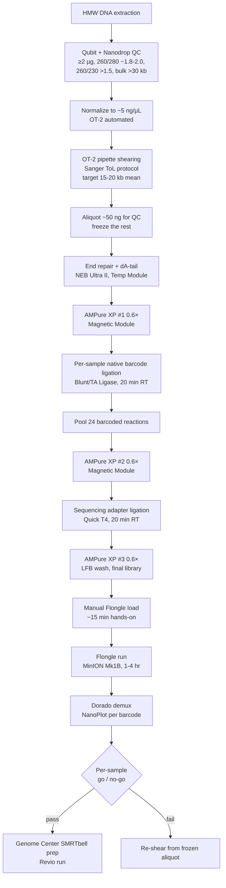

# In-House Flongle Diagnostic Pipeline (HiFi Shearing QC + More)

## Resources

**Equipment:** [[femtopulse]], [[minion-mk1b]], [[nanodrop]], [[opentrons-ot2]], [[ot2-magnetic-module]], [[ot2-temperature-module]]

**Kits:** [[qubit-dsdna-hs-assay-kit]], [[sqk-nbd114-24]]

**Reagents:** [[ampure-xp-beads]]

**Consumables:** [[flongle-flow-cells-flo-flg114]], [[wide-bore-filter-tips-p1000]], [[wide-bore-filter-tips-p200]]

**Related Protocols:** [[ot2-hmw-shearing]], [[ot2-automated-nbd114-prep]], [[flongle-sequencing-and-analysis]], [[pacbio-hifi-sequencing]]

**Contacts:** [[grey-monroe]]

**Status:** Planned, not yet validated. See [[in-house-hifi-shearing]] for project context. Do not use in production until the validation phase below is logged.

## What this pipeline is (and what it is not)

**This is a pre-Genome-Center diagnostic, not a replacement for the Genome Center.** The MinION + Flongle + OT-2 pipeline is a fast, cheap, same-day screening tool that runs **before** we commit samples to expensive downstream sequencing at the [[uc-davis-dna-technologies-core]]. The Genome Center remains the production sequencer for anything that needs real depth or publication-grade FemtoPulse traces.

The right mental model: **the Flongle is the lab's "look at any tube of dsDNA before you spend real money on it" tool.** Same hardware, same [[sqk-nbd114-24]] kit, different protocol variants for different use cases.

> **Important: the wrong kit was originally recommended.** The original project briefing called for **SQK-RBK114.24** (Rapid Barcoding Kit, transposase tagmentation). That kit is **wrong for size-faithful sequencing** because transposase cuts and tags in a single step; the output read length reflects transposase cut frequency, not input molecule length. If you fed it 15 kb sheared DNA, it would produce reads centered around ~5–10 kb and the QC would silently lie to you. The correct kit is **SQK-NBD114.24** (Native Barcoding Kit V14), which is **ligation-based** — adapters are ligated onto the existing ends without any cutting, so read length faithfully reflects input molecule length. **Always use NBD, never RBK, for any application in this pipeline.** See [[sqk-nbd114-24]] for the full comparison.

## Use cases in priority order

All use cases share the same hardware ([[minion-mk1b]] + [[flongle-flow-cells-flo-flg114]]), the same library kit ([[sqk-nbd114-24]]), and most of the same protocol — they differ mainly in **AMPure bead ratio**, **run time**, and **histogram interpretation**.

1. **Primary: PacBio HiFi shearing QC** — confirm OT-2-sheared HMW DNA hit 15–20 kb mean before committing to a $300+ SMRTbell library prep and a $1,400–2,000 Revio cell. Catches over- and under-shearing in hours instead of weeks. **This is the original driver for the project.**
2. **Pre-flight QC of any HiFi library before it ships** — run a small aliquot of a finished SMRTbell library on a Flongle to verify size distribution and check for adapter dimers or other oddities before sending to the Genome Center. Catches library-prep failures before they consume a Revio cell.
3. **Pre-flight QC of native HMW gDNA** before extraction is committed to library prep. Replaces some uses of FemtoPulse on incoming gDNA.
4. **Plasmid verification** — full sequence of any new plasmid construct, multiplexed up to 24 plasmids per run. Replaces Sanger walks for almost everything. Same-day.
5. **PCR amplicon and T-DNA insertion verification** — long-read amplicon sequencing of insertion sites, mutant alleles, large PCR products (3–10 kb). Provides full end-to-end confirmation Sanger cannot. Same-day.
6. **Accession / variety / cultivar ID** via low-coverage skim sequencing on a 24-plex Flongle (~40 Mb/sample captures tens of thousands of SNPs).
7. **Methylation screening** on native genomic DNA. 5mC/5hmC/6mA detection comes free with every nanopore run via Dorado modbase models. No bisulfite, no antibody.
8. **Pilot / development platform for Fiber-seq** — validate m6A labeling efficiency on a Flongle before committing to a full Revio run. Same MinION can later run full FLO-MIN114 flow cells (~$900, ~30 Gb) for production Fiber-seq.
9. **Stretch: short-read (Illumina) library QC** — pre-flight sanity check before a NovaSeq/MiSeq run. See [[illumina-library-qc-on-flongle]] for the dedicated protocol. **Requires a different AMPure ratio (1.8× instead of 0.6×)** — do not run this on the HMW-tuned protocol.

## Overview (HiFi shearing QC, the primary use case)

**Timing target: ~30–45 min hands-on, ~5–7 hr wall-clock** from frozen DNA to verdict, when [[ot2-automated-nbd114-prep]] is running as the default. Manual NBD114.24 prep ([[nbd114-multiplexed-flongle-prep]]) is ~3 hr hands-on and used only as a fallback.

## Sub-protocols

In order:

1. [[operating-the-ot2]] — prerequisite, general OT-2 operation
2. [[ot2-hmw-shearing]] — shears normalized HMW DNA to 15–20 kb
3. **Library prep (pick one):**
    - [[ot2-automated-nbd114-prep]] — **default production**, chained Python protocol on the OT-2
    - [[nbd114-multiplexed-flongle-prep]] — manual fallback when the robot is down
    - [[illumina-library-qc-on-flongle]] — stretch use case, 1.8× AMPure variant
4. [[flongle-sequencing-and-analysis]] — MinION run, Dorado demux, NanoPlot, go/no-go
5. [[in-house-vs-genome-center-decision]] — when to use this path vs. send out

Downstream: [[pacbio-hifi-sequencing]] (SMRTbell library prep on samples that pass QC at the Genome Center).

## OT-2 automation is the default

Manual NBD114.24 prep is ~3 hr hands-on. At that friction level the lab reverts to the Genome Center and the diagnostic pipeline dies. **The default production path is full OT-2 automation** via [[ot2-automated-nbd114-prep]].

### Step → OT-2 capability mapping (NBD114.24)

| Step | Action | OT-2 capability |
|---|---|---|
| 1. Normalize input concentrations | Pre-step from a CSV | Standard pipetting |
| 2. End repair + dA-tail (20 °C × 5 min, 65 °C × 5 min) | NEB Ultra II End Prep | Pipetting + [[ot2-temperature-module]] |
| 3. AMPure XP cleanup #1 | Post end-prep cleanup | [[ot2-magnetic-module]] |
| 4. Per-sample native barcode ligation (20 min RT) | Blunt/TA Ligase | Pipetting + ambient incubation |
| 5. Pool 24 barcoded reactions | Consolidation | Pipetting |
| 6. AMPure XP cleanup #2 (pool) | Post-ligation cleanup | [[ot2-magnetic-module]] |
| 7. Sequencing adapter ligation (20 min RT) | Quick T4 Ligase + AMX | Pipetting + ambient incubation |
| 8. AMPure XP cleanup #3 (final library) | Final cleanup, LFB or SFB wash | [[ot2-magnetic-module]] |

Steps 2–8 chain into a **single Python protocol** that runs unattended (~5–7 hr). Hands-on time breaks down to ~15 min deck load, ~5 min final library retrieval/Qubit, ~15 min Flongle load and launch. **Total ~30–45 min hands-on.**

Do not write this protocol from scratch. Start from published OT-2 community ports (protocols.io, Opentrons Protocol Library) and adapt — see [[ot2-automated-nbd114-prep]] § Python protocol for reference starting points.

## AMPure ratio rules (non-negotiable)

Every protocol page in this pipeline that uses AMPure XP **must state the bead ratio explicitly, explain why it was chosen, and warn against changing it without re-validating**. A changed ratio shifts the size bias and invalidates any calibration against the reference FemtoPulse trace.

| Use case | AMPure ratio | Low-end cutoff | Rationale |
|---|---|---|---|
| HiFi shearing QC (15–20 kb) | **0.6×** | ~1 kb | Harmless to HMW, removes unligated barcodes |
| Native HMW gDNA QC | **0.6×** | ~1 kb | Same |
| Plasmid verification (3–15 kb) | 0.6–0.8× | ~500 bp–1 kb | Matched to plasmid range |
| Amplicon / T-DNA (1–10 kb) | 0.8× | ~500 bp | Matched to amplicon range |
| **Illumina library QC (150–600 bp)** | **1.8×** | ~100 bp | Keeps shortest inserts; 0.6× would discard them and bias long |

**AMPure high-end elution inefficiency:** AMPure XP loses 5–30% of >30 kb fragments because they do not elute fully off the beads. This is a **constant offset, not noise**, and must be characterized once during the validation phase below and noted in the protocol for users to apply as a correction factor when interpreting HMW histograms.

## Validation phase (hard prerequisite to production use)

This workflow is **not validated until one calibration batch has been compared against a Genome Center FemtoPulse trace on the same samples**. See [[in-house-hifi-shearing]] § Validation Phase for the full procedure. Briefly:

1. Shear one batch of 8–12 HMW DNA samples on the OT-2.
2. Split each sample into Aliquot A (Genome Center FemtoPulse) and Aliquot B (in-house Flongle path).
3. Compare per-sample read-length histograms.
4. Document the offset as a constant correction factor.
5. Use the **same beads, same ratio, same Python protocol** that will run in production. Any change invalidates the calibration.

Until that calibration is logged, treat Flongle histograms as informative but not authoritative, and keep parallel FemtoPulse on critical batches. **This validation is non-negotiable — do not soften or skip it.**

## Critical gotchas (read before running)

- **Wrong kit (RBK114.24) is a silent failure.** Transposase tagmentation produces a plausible-looking but meaningless read-length histogram. Use [[sqk-nbd114-24]] only. If someone orders RBK by mistake, **do not run it** for shearing QC.
- **Wide-bore tips are non-negotiable** for any step touching HMW or sheared DNA. [[wide-bore-filter-tips-p200]] and [[wide-bore-filter-tips-p1000]] only. Narrow tips re-shear samples and falsify the QC.
- **AMPure ratio mismatch silently breaks calibration.** Never change the ratio in a validated protocol without re-validating. Write a new protocol file for a new use case.
- **Flongle flow cells are perishable** (~8 weeks refrigerated). Order on demand, don't stockpile.
- **Check Flongle pore count in MinKNOW before loading.** Below Oxford's warranty threshold → contact support for a replacement; do not waste a library.
- **The lab Qubit reads ~half of the Genome Center Qubit.** Use [[qubit-dsdna-hs-assay-kit]] and run HS + BR cross-checks on a few samples to calibrate. Root cause of the PB1361 over-shearing incident.
- **GEN2 modules assumed.** If a Python protocol fails on module load, see [[operating-the-ot2]] § GEN1 fallback.

## See also

- [[in-house-hifi-shearing]] (project page)
- [[pacbio-hifi-sequencing]]
- [[in-house-vs-genome-center-decision]]
- [[sqk-nbd114-24]]
- Sanger ToL [PacBio LI fragmentation protocol](https://www.protocols.io/view/sanger-tree-of-life-hmw-dna-fragmentation-opentron-g9cwbz2xf.html)
- Oxford Nanopore [SQK-NBD114.24 protocol](https://community.nanoporetech.com/docs/prepare/library_prep_protocols/ligation-sequencing-v14-native-barcoding-kit-24/)
