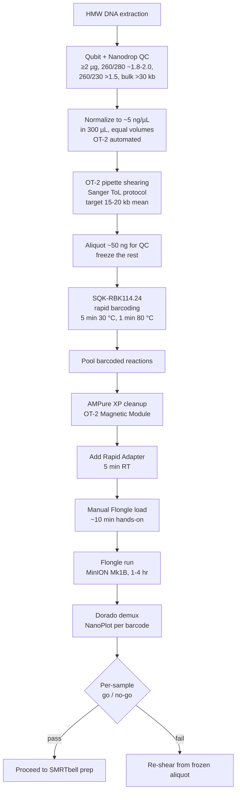

# In-House HiFi Shearing and QC Pipeline

**Status:** Planned, not yet validated. See [[in-house-hifi-shearing]] for project context. Do not use in production until the validation phase below is logged.

## Purpose

End-to-end workflow that takes high-molecular-weight DNA from extraction to a per-sample go/no-go QC verdict for PacBio HiFi library prep, **without sending anything to the [[uc-davis-dna-technologies-core]]**. Replaces the CybioFelix shearing and FemtoPulse size QC services with on-deck OT-2 pipette shearing and Oxford Nanopore Flongle read-length QC.

## Overview

End-to-end wall clock: **~4-7 hours** from frozen DNA to verdict, with three discrete human touchpoints (load OT-2 deck, load Flongle, look at histograms). Per-batch hands-on time: **~45 minutes**.

## Sub-protocols

In order:

1. [[operating-the-ot2]] — prerequisite, general OT-2 operation
2. [[ot2-hmw-shearing]] — shears normalized HMW DNA to 15-20 kb
3. [[flongle-rapid-barcoding-rbk114]] — multiplexed library prep on the sheared aliquots
4. [[flongle-sequencing-and-analysis]] — MinION run, demux, read-length histograms, go/no-go
5. [[in-house-vs-genome-center-decision]] — when to use this path vs. send out

Downstream: [[pacbio-hifi-sequencing]] (SMRTbell library prep on samples that pass QC).

## When to use this pipeline

See [[in-house-vs-genome-center-decision]] for the full table. Rule of thumb:

- **In-house** for batches ≥8 samples, when same-day turnaround matters, when the Genome Center is queued out, or when Noravit is unavailable.
- **Genome Center** for tiny batches (≤4), as backup if the in-house path is broken, or when a FemtoPulse trace is required for a publication or report.

## Timing and cost

| Step | Wall time | Hands-on | Cost (24-sample batch) |
| --- | --- | --- | --- |
| Normalize + shear ([[ot2-hmw-shearing]]) | 60-90 min | 10 min | tips + plastics, ~$10 |
| Rapid barcoding + cleanup ([[flongle-rapid-barcoding-rbk114]]) | 60 min | 20 min | ~$120 (1/6 of [[sqk-rbk114-24]]) |
| Flongle run ([[flongle-sequencing-and-analysis]]) | 1-4 hr | 15 min | ~$90 (one [[flongle-flow-cells-flo-flg114]]) |
| Demux + NanoPlot | 30-60 min | 5 min | free |
| **Total per 24-sample batch** | **~4-7 hr** | **~45 min** | **~$220** |
| **Per-sample** | | | **~$10** |

For comparison, sending the same 24 samples to the Genome Center: $70 shearing + 24 × $27 FemtoPulse = **$718**, 1-2 week queue.

## Validation phase (prerequisite to production)

This workflow is **not validated until one calibration batch has been compared against FemtoPulse**. The validation procedure lives on the project page: see [[in-house-hifi-shearing]] § Validation Phase. Briefly:

1. Shear one batch of 8-12 samples on the OT-2.
2. Split each sample into Aliquot A (FemtoPulse at the Genome Center) and Aliquot B (in-house Flongle path).
3. Compare per-sample read-length histograms.
4. Document the offset as a correction factor.
5. Use the **same beads, same ratio, same Python protocol** that will run in production. Any change invalidates the calibration.

Until that calibration is logged, treat Flongle histograms as informative but not authoritative, and keep parallel FemtoPulse on critical batches.

## Critical gotchas (read before running)

- **Wide-bore tips are non-negotiable** for any step touching HMW or sheared DNA. [[wide-bore-filter-tips-p200]] and [[wide-bore-filter-tips-p1000]] only. Standard narrow tips re-shear samples and falsify the QC.
- **Flongle flow cells are perishable** (~8 weeks refrigerated). Order on demand, don't stockpile.
- **Check Flongle pore count in MinKNOW before loading.** If it is below Oxford's warranty threshold, contact them for a replacement before using.
- **The lab Qubit reads ~half of the Genome Center Qubit.** Use [[qubit-dsdna-hs-assay-kit]] and run HS + BR cross-checks on a few samples to calibrate. Document the offset in your batch notes. This was the root cause of the PB1361 over-shearing incident.
- **Do not extend the transposase incubation** in [[flongle-rapid-barcoding-rbk114]] hoping for better tagging. Longer incubations skew the size distribution shorter and lie to your QC.
- **AMPure XP has elution inefficiency for very large fragments** (>30 kb). This causes a small high-end size bias in the Flongle histogram. The validation run will quantify it.
- **GEN2 modules assumed.** If a Python protocol fails on module load, see [[operating-the-ot2]] § GEN1 fallback.

## See also

- [[in-house-hifi-shearing]] (project page)
- [[pacbio-hifi-sequencing]]
- [[in-house-vs-genome-center-decision]]
- Sanger ToL [PacBio LI fragmentation protocol](https://www.protocols.io/view/sanger-tree-of-life-hmw-dna-fragmentation-opentron-g9cwbz2xf.html)
- Oxford Nanopore [SQK-RBK114.24 protocol](https://nanoporetech.com/document/rapid-sequencing-gdna-barcoding-sqk-rbk114)
