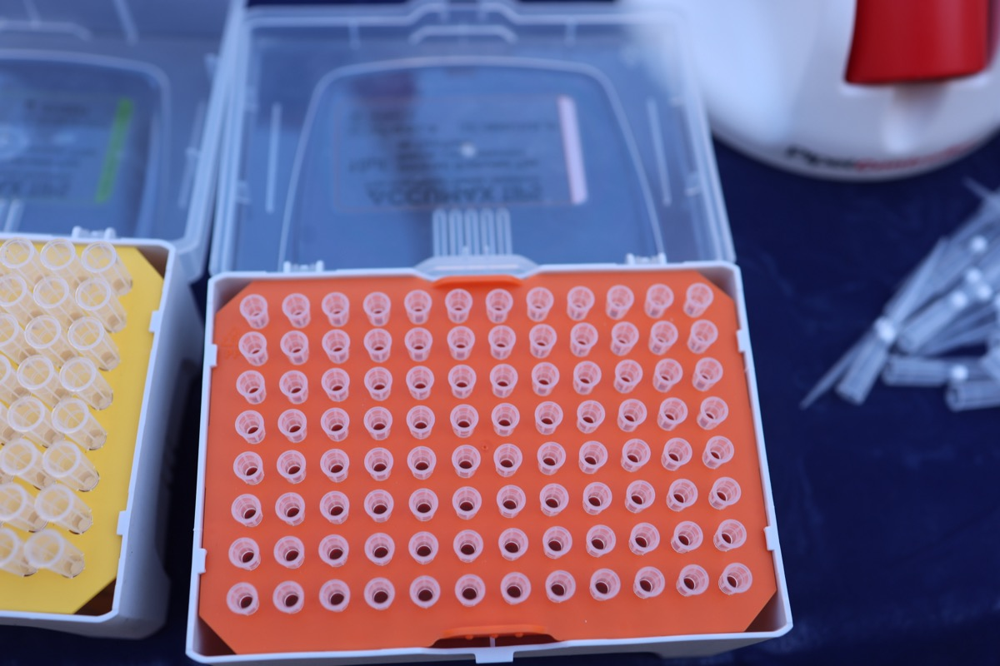

# Pipette School

## Resources

**Equipment:** [[micropipette-p10]], [[micropipette-p20]], [[micropipette-p200]], [[micropipette-p1000]]

**Consumables:** [[pipette-tips-p10]], [[pipette-tips-p20]], [[pipette-tips-p200]], [[pipette-tips-p1000]], [[filter-tips-p10]], [[filter-tips-p20]], [[filter-tips-p200]], [[filter-tips-p1000]], [[microtube]], [[pcr-strip-tubes-0-2ml]], [[parafilm]]

**Reagents:** Distilled water, food coloring (optional, for visibility)

**Related Protocols:** [[tube-and-sample-labeling]]

**Purpose:** Learn to pipette accurately and consistently. Pipetting is the most fundamental lab skill. Every protocol downstream depends on your ability to deliver precise volumes. This is a dedicated ~2.5 hour training session with structured exercises.

## Time estimate

**Wall time:** ~2.5 hr | **Hands-on:** 2.5 hr

---

## Background

A micropipette is a precision instrument for transferring small liquid volumes (0.1 uL to 1000 uL). Different pipette sizes cover different volume ranges. Using the wrong size or technique introduces errors that compound through every downstream step.

**Why this matters:** A 10% pipetting error in a PCR master mix means some reactions get too much enzyme and some get too little. A sloppy DNA quantification means you load the wrong amount into a library prep. Pipetting errors are the #1 source of failed experiments for new lab members.

## The Pipettes

<!-- PHOTO: Our Fisher Elite pipette set on the bench, showing P10/P20/P200/P1000 — TODO add -->

The lab has several micropipettes. Each covers a specific volume range. **Never dial a pipette outside its stated range** — this damages the calibration.

| Pipette | Range | Tip color | When to use |
|---------|-------|-----------|-------------|
| P2 | 0.1–2 uL | | Very small volumes (rare in routine work) |
| [[micropipette-p10|P10]] | 0.5–10 uL | | Enzyme additions, small reagent volumes |
| [[micropipette-p20|P20]] | 2–20 uL | | PCR components, small buffer additions |
| [[micropipette-p200|P200]] | 20–200 uL | | Most common. DNA samples, buffer additions, gel loading |
| [[micropipette-p1000|P1000]] | 100–1000 uL | | Large volumes. Filling tubes, buffer prep |

### Reading the volume dial

The pipette has a three-digit (or four-digit) display on the plunger. The decimal point position depends on the pipette size:

- **P10:** digits read as X.XX uL (e.g., 0.50 = 0.50 uL, 10.0 = 10.0 uL)
- **P20:** digits read as XX.X uL (e.g., 15.0 = 15.0 uL)
- **P200:** digits read as XXX uL (e.g., 150 = 150 uL)
- **P1000:** digits read as XXXX uL (e.g., 1000 = 1000 uL)

If you aren't sure how to read the display, ask before pipetting.

## Tips

- **Always use the correct tip size** for your pipette. Tips are not interchangeable.
- **Filter tips** (available for all pipette sizes — [[filter-tips-p10|P10]], [[filter-tips-p20|P20]], [[filter-tips-p200|P200]], [[filter-tips-p1000|P1000]]) sit inside the tip and catch aerosols before they reach the pipette barrel. Use them when cross-contamination would wreck the experiment: PCR master mix, low-copy templates, sensitive amplicon work, RNA handling. Don't default to filter tips for everything — they cost more per tip, and for routine transfers (most DNA pipetting, buffers, water, training exercises) regular tips are fine. Pick based on what you're actually doing.
- **Tip ejection:** Use the ejector button to drop the tip into the waste. Never pull a tip off by hand.

## Technique

### Forward pipetting (standard)

This is the technique you will use 99% of the time.

<iframe width="560" height="315" src="https://www.youtube.com/embed/Wx8clzD-CO4" frameborder="0" allowfullscreen style="max-width:100%;border-radius:8px;margin:12px 0"></iframe>

*Video: How to Pipette in 5 Simple Steps (Eppendorf) — 5-minute walkthrough of proper forward pipetting technique.*

See also the [Eppendorf Video Guide to Perfecting Your Pipetting Technique](https://www.eppendorf.com/us-en/lab-academy/topics-methods-technology/pipetting-dispensing/the-eppendorf-video-guide-to-perfecting-your-pipetting-technique/) for the full series.

1. **Set the volume** by turning the dial. Never force the dial past the pipette's range.
2. **Attach a tip** by pressing the pipette firmly into the tip box. One firm push. Don't hammer it.
3. **Depress the plunger to the first stop.** You will feel a clear resistance point. Stop there.
4. **Insert the tip** into the liquid. Submerge 2-3 mm below the surface. Not deeper.
5. **Slowly release the plunger.** Let it rise smoothly. Do not let it snap back. Liquid draws into the tip.
6. **Pause** for 1 second with the tip still in the liquid. This allows the full volume to enter the tip.
7. **Withdraw the tip** from the liquid. Touch the tip to the vessel wall briefly to remove any droplet hanging on the outside.
8. **Move to the destination vessel.**
9. **Depress the plunger to the first stop** to dispense. Then push through to the **second stop** (blowout) to expel the last drop.
10. **Withdraw the tip** while holding the plunger at the second stop.
11. **Release the plunger** only after the tip is out of the liquid.
12. **Eject the tip.**

### Common errors

| Error | What happens | How to avoid |
|-------|-------------|--------------|
| Plunging too fast | Air bubbles in the tip, inaccurate volume | Slow, steady pressure |
| Submerging too deep | Liquid on the outside of the tip, extra volume delivered | 2-3 mm below surface |
| Letting plunger snap back | Inconsistent aspiration, aerosol into barrel | Control the release |
| Not pausing after aspiration | Incomplete fill, short volume | Count "one-one-thousand" |
| Forgetting blowout | Residual liquid left in tip | Always push to second stop on dispense |
| Pipetting with the pipette at an angle | Volume error | Hold pipette vertically during aspiration |

## Exercises

<iframe width="560" height="315" src="https://www.youtube.com/embed/videoseries?list=PLCKY0OHNBaBnoeWPIuWhL-rPeTrAZ9cFy" frameborder="0" allowfullscreen style="max-width:100%;border-radius:8px;margin:12px 0"></iframe>

*Video: Micropipetting Tutorial Series (miniPCR) — 4-video series covering pipette selection, technique, and practice exercises.*

Do all of these. They are not optional.

### Exercise 1: Consistency test (P200)

1. Set P200 to 100 uL.
2. Pipette 100 uL of water into a microcentrifuge tube. Repeat 10 times into the same tube (total: 1000 uL = 1 mL).
3. The final volume should be exactly at the 1 mL mark on the tube.
4. If it's noticeably over or under, your technique needs adjustment. Repeat.

### Exercise 2: Consistency test (P20)

1. Set P20 to 10 uL.
2. Pipette 10 uL of water 10 times into a PCR tube (total: 100 uL).
3. Compare the volume against a single 100 uL pipette from the P200.
4. They should match. If they don't, you have a technique problem at the small-volume end.

### Exercise 3: Small volume precision (P10)

1. Set P10 to 2 uL.
2. Pipette 2 uL of colored water onto a piece of parafilm. Repeat 5 times, making 5 separate droplets.
3. All droplets should be the same size. Visually compare them.
4. If one is obviously larger or smaller, identify what you did differently on that pipette.

### Exercise 4: Serial dilution

1. Label 5 microcentrifuge tubes: 1, 2, 3, 4, 5.
2. Put 900 uL of water in each tube.
3. Add 100 uL of colored water to tube 1. Mix by pipetting up and down 5 times.
4. Transfer 100 uL from tube 1 to tube 2. Mix.
5. Transfer 100 uL from tube 2 to tube 3. Mix. Continue to tube 5.
6. You should see a clear gradient of decreasing color intensity from tube 1 to tube 5. Photograph the series.

This is a 1:10 serial dilution. Each tube is 10x more dilute than the previous. You will use serial dilutions when preparing DNA standards, diluting primers, and setting up Qubit assays.

### Exercise 5: Mock PCR reaction (dyes instead of reagents)

Before setting up a real PCR, practice the motions with colored water. It builds muscle memory for small precise volumes and catches technique problems before you waste enzyme.

Set up (per trainee):

- 4 microcentrifuge tubes of colored water as "stock" reagents. Use food coloring for each:
  - **Blue** = DNA template
  - **Red** = primer mix
  - **Green** = enzyme mix
  - **Yellow** = 2x buffer
- 1 microcentrifuge tube of clear distilled water labeled "dH2O blank"
- A strip of PCR tubes (0.2 mL, 8-well)

Then:

1. **Aliquot.** Use a P20 to transfer 20 uL of each colored stock into a fresh microcentrifuge tube — simulating how you'd pull a working aliquot from a shared lab stock.
2. **Assemble 4 reactions**, one per PCR tube. Each gets:
  - 10 uL blue (DNA)
  - 2 uL red (primers)
  - 0.5 uL green (enzyme)
  - 7.5 uL yellow (buffer)
  - Total: 20 uL per tube
3. **Run it twice.** First round: do all 4 reactions without changing tips between colors. Second round: fresh tip every transfer. Compare the tubes — the first round will look muddy where cross-contaminated, the second round will show clean layered color. This is the visual argument for changing tips.
4. **Set up a blank.** One extra PCR tube with 20 uL of dH2O and nothing else. That's your negative control. Clear vs. colored.

Targets:

- All 4 real reactions should have the same total volume and the same color intensity.
- The blank should stay clear.

If one tube ends up off-color or off-volume, you can usually identify which step went wrong by which color is short or extra.

## When you are done

- You should feel confident picking up any pipette, setting a volume, and delivering it accurately.
- You should know which pipette to grab for a given volume without thinking about it.
- You should be able to do a serial dilution without guidance.

## Documentation

Create a lab notebook entry. Date it. Cite this protocol. Include:

- Photographs of your serial dilution (Exercise 4)
- Notes on any exercises where you had to repeat
- Which pipette sizes you practiced with
